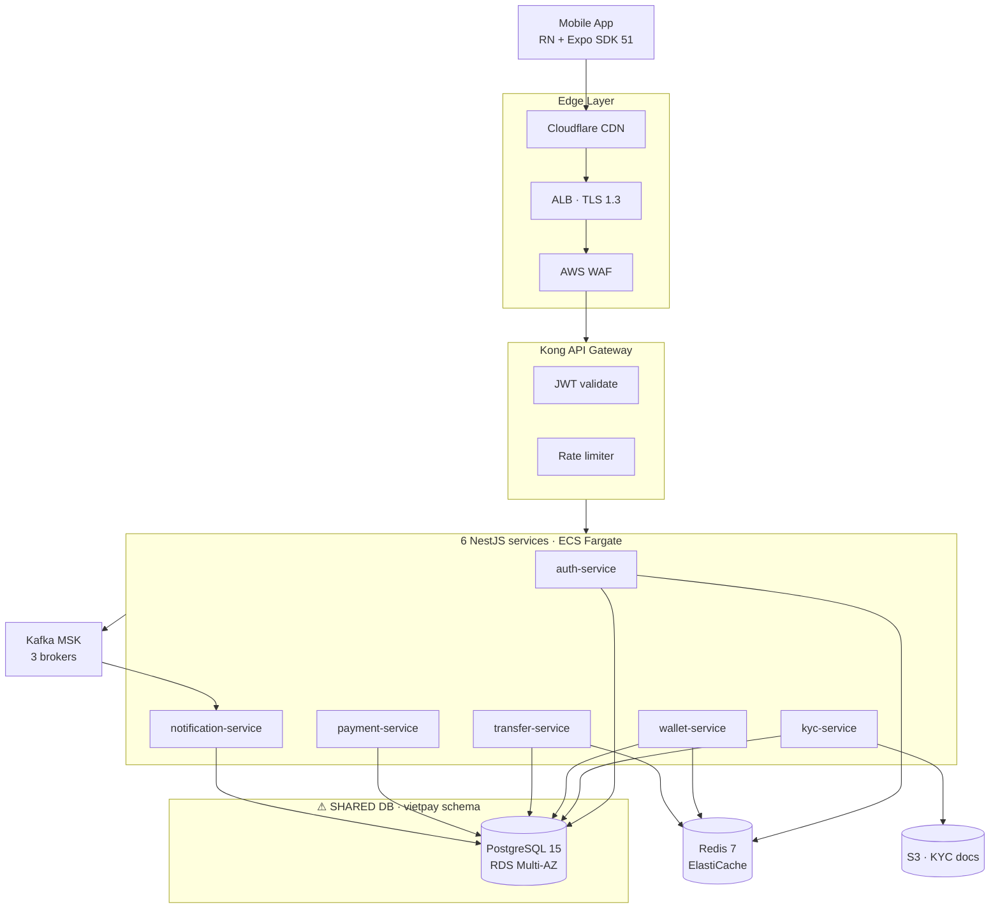
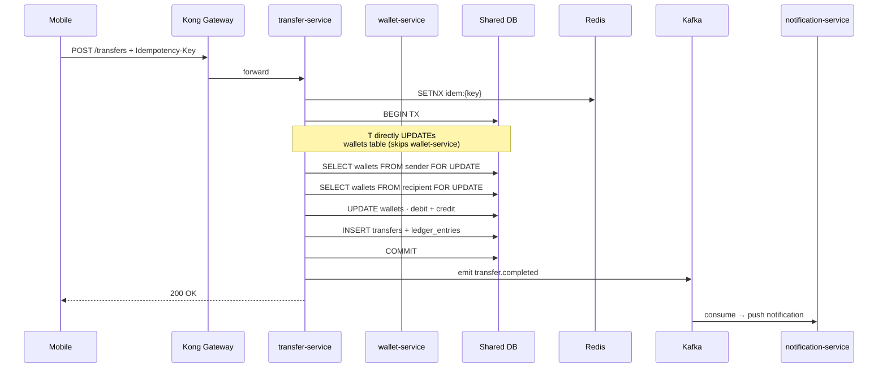

# VietPay V1 — 現状アーキテクチャ（As-Is）

**作成日:** 2026-05-05 · **ソース:** Reverse Engineer Agent + dependency-graph + DBイントロスペクション
**目的:** V2を設計する前のベースラインです。変更する前に、現在何が稼働しているのかを把握する必要がございます。

---

## 1. 高レベルトポロジー（V1 本番環境）



**主要なアンチパターン:** 6つのマイクロサービス全てが、同一のPostgreSQLスキーマ`vietpay`を共有しております。さらにwallet-serviceとtransfer-serviceは互いのテーブルへ直接アクセスしており（サービス境界を回避）、設計上の問題となっております。

---

## 2. サービス責務（現状）

| サービス | 所有テーブル | 他サービスから直接DB参照 | 他サービスへのHTTP呼び出し |
|---------|------|-------------------------------|---------------------|
| auth-service | users, sessions | — | — |
| kyc-service | kyc_records, kyc_documents | users (auth) | — |
| wallet-service | wallets, ledger_entries | users (auth) | — |
| transfer-service | transfers, idempotency_keys | wallets (wallet) ⚠, users (auth) | payment-service |
| payment-service | payments, qr_codes, webhooks, linked_banks | wallets ⚠, users | sepay external |
| notification-service | notifications, prefs, device_tokens | users | — |

⚠ = サービス境界違反

---

## 3. クリティカルパス: P2Pトランスファー（現状V1）



**問題点:** transfer-serviceがwallet-serviceを**バイパス**し、`wallets`テーブルを直接更新しております。理由（レガシー事情）: wallet-serviceにアトミックなdebit+creditのエンドポイントが存在しなかったため、トランスファーチームがショートカットを選択した経緯がございます。V2では内部エンドポイント追加またはイベント駆動方式により修正する必要があります。

---

## 4. データベーススキーマ（現状）

単一スキーマ`vietpay`に47テーブルが含まれております:

```sql
-- Core auth (8 tables)
users, sessions, device_keys, otp_log, login_attempts,
password_reset_requests, account_deletion_requests, audit_users

-- KYC (5 tables)
kyc_records, kyc_documents, kyc_manual_reviews,
kyc_provider_calls, kyc_audit

-- Wallet (7 tables) -- ⚠ SHARED schema with transfer
wallets, wallet_balances_cache, ledger_entries,
wallet_freeze_log, wallet_audit, wallet_status_log,
balance_reconciliation

-- Transfer (9 tables) -- ⚠ SHARED schema with wallet
transfers, idempotency_keys, daily_limits_mv,
transfer_cancellations, transfer_failures, transfer_retries,
recipient_phone_index, transfer_audit, transfer_metrics_daily

-- Payment (8 tables)
payments, qr_codes, webhooks, linked_banks,
pending_verifications, topups, withdrawals, payment_audit

-- Notification (4 tables)
notifications, notification_preferences,
device_tokens, notification_delivery_log

-- Audit / shared (6 tables)
audit_log_partitioned, feature_flags, system_events,
ip_geolocation_cache, error_log, deploy_log
```

**外部キー:** 合計64件。クロスドメインFK（アンチパターン、V2で削除予定）: 12件。

**インデックス:** 138件。ホットインデックス: `transfers(user_id, created_at DESC)`, `wallets(user_id, currency)`, `kyc_records(status, created_at)`。

---

## 5. イベントストリーム（Kafka）

アクティブなトピック12件:

| トピック | プロデューサー | コンシューマー | パーティション数 | 保持期間 |
|-------|----------|----------|-----------:|-----------|
| `transfer.created` | transfer-service | notification, audit | 6 | 7d |
| `transfer.completed` | transfer-service | notification, audit, analytics | 6 | 7d |
| `transfer.cancelled` | transfer-service | notification, audit | 3 | 7d |
| `transfer.failed` | transfer-service | notification, audit, oncall-alert | 3 | 30d |
| `topup.completed` | payment-service | wallet-service, notification | 6 | 7d |
| `payment.qr.scanned` | payment-service | analytics | 3 | 7d |
| `payment.webhook.received` | payment-service | audit | 3 | 30d |
| `kyc.completed` | kyc-service | auth-service, notification | 3 | 7d |
| `kyc.rejected` | kyc-service | auth-service, manual-review-bot | 3 | 30d |
| `notification.requested` | all services | notification-service | 6 | 1d |
| `audit.event` | all services | audit-shipper (S3) | 6 | 30d |
| `slo.breach` | observability | oncall-alert | 1 | 90d |

---

## 6. 外部連携

| ベンダー | 用途 | SLA | バックアップ計画 |
|--------|---------|-----|-------------|
| Sepay | VietQR + 銀行送金 | 99.5% | なし（単一障害点） |
| VNPT eKYC | OCR + ライブネス検出 | 99.0% | FPT eKYC（未統合） |
| Stringee | SMS OTP | 99.9% | Twilio（未統合） |
| FCM | Android プッシュ通知 | 99.95% | — |
| APNs | iOS プッシュ通知 | 99.9% | — |

**リスク:** Sepayにフォールバックがございません。Sepayが停止すると、銀行送金・VietQRスキャン・トップアップが全て使用不可となります。V2では主要5銀行のバックアップとしてVNPay直接連携の追加を検討すべきです。

---

## 7. デプロイモデル

```
ap-southeast-1 (Singapore) — primary, all production traffic
eu-central-1 (Frankfurt) — provisioned but inactive (dormant DR)
```

**アクティブリソース** (リージョン毎):
- VPC 10.0.0.0/16, 3 AZ
- ECS Fargate cluster `vietpay-prod`
- RDS PostgreSQL Multi-AZ (db.r6g.xlarge)
- ElastiCache Redis cluster (3 master + 3 replica)
- MSK Kafka (3 brokers)
- S3 buckets (KYC, receipts, audit log)

**デプロイ頻度:** 本番デプロイ週2〜3回。コミットから本番までの平均リードタイム: 4時間。

---

## 8. オブザーバビリティスタック

| レイヤー | ツール | 備考 |
|-------|------|-------|
| メトリクス | DataDog | サービス毎のREDメトリクス、コスト約$400/月 |
| ログ | DataDog logs | 30日保持 |
| トレース | DataDog APM | OpenTelemetryインストルメント済み |
| モバイルエラー | Sentry | crash-free率 99.6%（2026年5月時点） |
| バックエンドエラー | Sentry | issue tracking |
| 稼働監視 | DataDog Synthetics | 5リージョンプローブ |
| オンコール | PagerDuty | エンジニアチームローテーション、24/7 |

**SLOダッシュボード**（現状）:
- API可用性: 99.91%（目標 99.9%）✓
- p95レイテンシ: 178ms（目標 <200ms）✓
- トランザクション成功率: 99.62%（目標 ≥99.5%）✓
- エラーバジェット消費率: 14%（28日間）

---

## 9. 課題マッピング（V2計画への対応）

| 現状の課題 | V2での対応 |
|------------|--------|
| wallet+transferでのDBスキーマ共有 | サービス毎に別DBへ分割・ストラングラーフィグパターン |
| Walletの神クラス 814 LOC | 4モジュールに分割、各々200 LOC未満 |
| transferがwallet-serviceをバイパス | アトミックなdebit+credit内部HTTPエンドポイント追加 |
| Sepayにバックアップなし | 主要5銀行向けにVNPay直接連携追加 |
| 返金機能未実装 | V2スコープ外（V3候補） |
| 4モジュールでテストカバレッジゼロ | 変更前にキャラクタリゼーションテスト追加 |
| 公共料金支払い・トップアップ未実装 | V2で新規モジュール構築 |

---

## 10. As-Is vs To-Be（差分一覧）

| 項目 | As-Is V1 | To-Be V2 |
|--------|---------|----------|
| サービス数 | 6 | 8（+ bill-payment, +topup） |
| DBスキーマ | 1共有 | サービス毎（wallet, transfer, payment, ...） |
| 公共料金支払い | ❌ | ✅ EVN, インターネット, モバイル, 水道 |
| モバイルトップアップ | ❌ | ✅ Viettel, Vinaphone, Mobifone |
| Sepayフォールバック | ❌ | ✅ VNPayバックアップ（主要5銀行） |
| Wallet神クラス | 814 LOC × 1 | <200 LOC × 4モジュール |
| テストカバレッジ | 71% | 85%目標 |
| マルチリージョン | DR休眠中 | アクティブ-パッシブ |

---

**参照元ドキュメント:**
- `docs/gap-analysis.md`（要件比較 → ギャップ特定）
- `plans/260505-1100-vietpay-v2/migration-plan.md`（ストラングラーフィグ戦略）
- `docs/characterization-tests-spec.md`（リファクタリング前の挙動固定）
