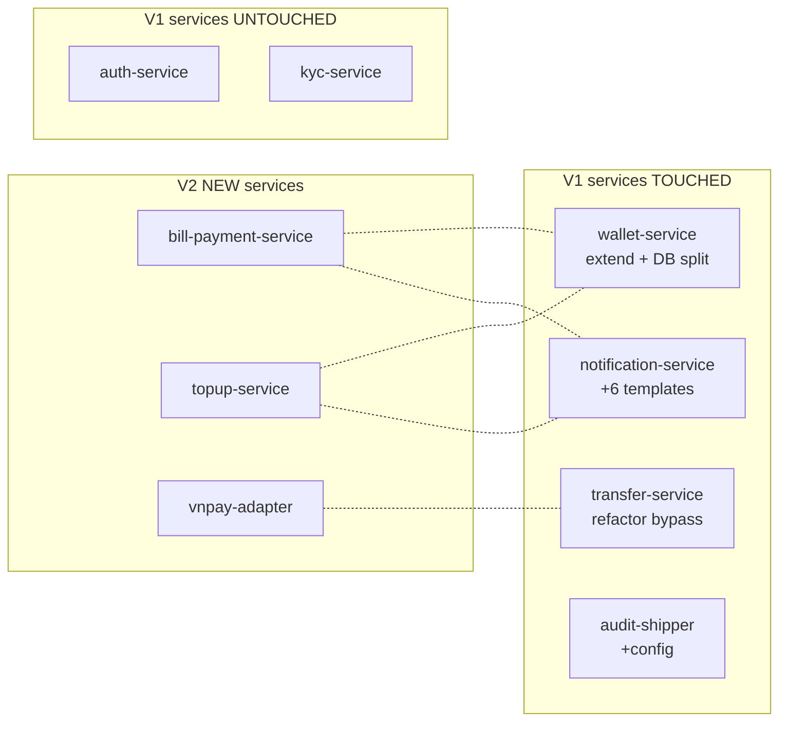

# VietPay V1 → V2 — ギャップ分析

**作成日:** 2026-05-06 ・ **ソース:** Gap Analyzer Agent
**インプット:** `customer-input/v2-requirements-brief.docx` + `docs/codebase-summary.md` + `docs/architecture-as-is.md`
**ステータス:** プロダクトオーナー＋テックリード承認済 — マイグレーションプランへ反映

---

## 1. お客様ブリーフ（要約）

> V1リリース後18ヶ月、MAU 312千件達成。VietPay V2では以下が必要となります：
> - **請求書支払い（Bill Payment）**: 電気（EVN）・インターネット・モバイル・水道。ユーザーアンケートのトップ4ユースケース。
> - **モバイルチャージ（Mobile Top-up）**: 携帯電話のチャージ（Viettel、Vinaphone、Mobifone）。
> - **インフラ**: モノリシックな共有DBがスケールを阻害 → マイクロサービス化（DB-per-service）が必要。
> - **トランザクション量見積り**: 請求書＋チャージで日次5万件の追加（ピーク時）。
> - **タイムライン**: 2026年Q3ローンチ（開発8週間＋ベータ2週間＋ロールアウト2週間）。
>
> — *VietPayプロダクトオーナー（Linh M.）、ブリーフ 2026-04-28 + Slackスレッド #vietpay-v2*

---

## 2. ギャップサマリー

| バケット | 件数 | 重大度 |
|--------|------:|----------|
| 新規モジュール | 4 | — |
| サービス拡張 | 3 | — |
| マイグレーション（高リスク） | 2 | 🔴 Critical |
| 改善・軽微 | 3 | 🟢 Low |
| **合計ギャップ** | **12** | |

---

## 3. ギャップカタログ

### 🔵 新規モジュール（4件）

#### GAP-01 ・ Bill Payment Service
- **As-is**: ❌ なし
- **To-be**: ✅ 4プロバイダーをハンドルする新サービス
  - EVN（ベトナム電力公社）— トップユースケース
  - インターネット（FPT、Viettel、VNPT）
  - モバイル後払い（Viettel、Vinaphone、Mobifone）
  - 水道（ホーチミン市・ハノイ・ダナン）
- **タイプ**: 新規モジュール
- **リスク**: Medium ・ Sepay請求書支払いAPIに依存（未統合）
- **見積り**: 3週間（バックエンド1名＋モバイル1名、並行作業）
- **依存関係**: Sepay請求書支払いAPIのオンボーディング（並行キックオフ）

#### GAP-02 ・ Mobile Top-up Service
- **As-is**: ❌ なし
- **To-be**: ✅ 3キャリア（Viettel、Vinaphone、Mobifone）のプリペイドカード向け携帯チャージ
- **タイプ**: 新規モジュール
- **リスク**: Low ・ SepayにはチャージAPIが既にあり
- **見積り**: 1.5週間
- **依存関係**: transfer-serviceのウォレットdebitロジックを再利用

#### GAP-03 ・ VNPay バックアップアダプター（耐障害性）
- **As-is**: ❌ Sepayが単一障害点（SPOF）
- **To-be**: ✅ トップ5銀行（VCB、BIDV、VTB、Agribank、MB）向けVNPay直接統合 — Sepayダウン時のフォールバック
- **タイプ**: 新規モジュール（アダプターパターン）
- **リスク**: Low ・ VNPayサンドボックスでコントラクトテスト
- **見積り**: 1週間
- **依存関係**: VNPayマーチャントオンボーディング（法務チームが対応）

#### GAP-04 ・ 定期請求書支払い（V2スコープ外）
- **As-is**: ❌ なし
- **To-be**: 将来 — 月次請求書の自動支払い
- **タイプ**: バックログ（V3）
- **決定**: プロダクトオーナーがV2スコープ外を確認（フォーカスして早期リリース）

---

### 🟡 サービス拡張（3件）

#### GAP-05 ・ Wallet Service ・ 内部debit/creditエンドポイント追加
- **As-is**: transfer-serviceがwallet-serviceをバイパスし、`wallets`テーブルを直接UPDATE（アンチパターン）
- **To-be**: wallet-serviceが内部エンドポイント `POST /wallets/internal/debit-credit` をアトミックに公開、クロスサービス処理に使用
- **タイプ**: 拡張（既存サービスへの新エンドポイント）
- **リスク**: Medium ・ transfer-serviceコードの移行が必要
- **見積り**: 1週間（wallet-serviceのDB分割完了後）
- **依存関係**: GAP-08（DB分割）にブロックされる

#### GAP-06 ・ Notification Service ・ 請求書支払い＋チャージテンプレート追加
- **As-is**: 通知テンプレート 8件
- **To-be**: + 6件の新テンプレート（bill-success、bill-failed、topup-success、topup-failed、recurring-reminder（V2未使用）、bill-reminder）
- **タイプ**: 拡張
- **リスク**: Low ・ テンプレートエンジンは準備済
- **見積り**: 2日

#### GAP-07 ・ Audit Service ・ コンプライアンススコープ拡張
- **As-is**: 監査ログがtransfer＋チャージをカバー
- **To-be**: + 請求書支払い＋VNPayコールをSBV（ベトナム国家銀行）要件に従って監査
- **タイプ**: 拡張（設定＋ルールセット）
- **リスク**: Low
- **見積り**: 1日

---

### 🔴 クリティカルマイグレーション（2件）

#### GAP-08 ・ Wallet Service ・ 共有DBスキーマ分割
- **As-is**: `wallets`、`ledger_entries` などがtransfer-serviceと `vietpay` スキーマを共有
- **To-be**: 別の `wallet_db`（独自RDSインスタンスまたは厳格なアクセス制御による別スキーマ）
- **タイプ**: マイグレーション 🔴 高リスク
- **戦略**: Strangler Fig + デュアルライト
  - Week 1-2: 新wallet_dbスキーマ構築（ミラー）
  - Week 3: wallet-serviceから旧＋新DB両方へのデュアルライト有効化
  - Week 4: 読み取りトラフィック 5% → 25% → 100% で新DBへ切替
  - Week 5: 旧DBを読み取り専用化 ・ 1週間モニタリング
  - Week 6: 共有スキーマから旧walletテーブルを削除
- **リスク**: デュアルライトウィンドウ中のデータ不整合（ミティゲーション：時次整合性チェッカージョブ＋アラーム）
- **見積り**: 6週間（クリティカルパス最長アイテム）
- **影響MAU**: 全312千件

#### GAP-09 ・ Transfer Service ・ wallet-serviceバイパス停止
- **As-is**: transfer-serviceが `wallets` テーブルを直接更新（`transfer.service.ts` の67-89行目）
- **To-be**: transfer-serviceが内部HTTP経由で `wallet-service.internalDebitCredit()` を呼出
- **タイプ**: マイグレーション（クリティカルパスのリファクタリング）
- **リスク**: 🔴 Critical ・ transferホットパス（約78千tx/日）— バグ＝送金ロス
- **戦略**: 既存挙動を特性化テストで固定 → リファクタリング → A/B 1% → 100%
- **見積り**: 2週間（GAP-05＋GAP-08完了後）
- **依存関係**: GAP-05＋GAP-08にブロックされる

---

### 🟢 改善・軽微（3件）

#### GAP-10 ・ モバイルUX ・ 請求書支払いクイックピック
- **As-is**: ユーザーが毎回請求書コードを入力
- **To-be**: 直近5件の請求書を保存、クイック支払いボタン
- **タイプ**: UX改善
- **見積り**: 3日

#### GAP-11 ・ 古いdependencies
- **As-is**: 23パッケージが古く、4件にCVE high
- **To-be**: 全て最新化
- **タイプ**: メンテナンス
- **リスク**: Low（semver互換アップグレード）
- **見積り**: 2日

#### GAP-12 ・ V2メトリクス用DataDogダッシュボード
- **As-is**: V1メトリクスはカバー済
- **To-be**: + 請求書支払い成功率 ・ チャージレイテンシ ・ VNPayフォールバック率
- **タイプ**: オブザーバビリティ
- **見積り**: 1日

---

## 4. 変更影響マップ

**影響を受けるエンドポイント**: 23件（新サービスへの新規エンドポイントが大半＋既存4件の修正）。
**マイグレーション対象DBテーブル**: 8件（walletスキーマ）。新規テーブル：11件（bill-payment＋topup＋audit拡張）。
**新規・修正モバイル画面**: 14件新規＋6件修正。

---

## 5. 工数見積りサマリー

| ワークストリーム | 見積り | 依存関係 |
|------------|----------|--------------|
| V1ホットパス特性化テスト（リファクタ前） | 1.5週間 | 独立 |
| GAP-08 Wallet DB分割（strangler） | 6週間 | なし（Day 1キックオフ） |
| GAP-05 Wallet内部エンドポイント | 1週間 | GAP-08 W3後 |
| GAP-09 Transferバイパスリファクタ | 2週間 | GAP-05後 |
| GAP-01 Bill payment service | 3週間 | 並行 ・ Sepayオンボーディング |
| GAP-02 Topup service | 1.5週間 | 並行 ・ GAP-05後 |
| GAP-03 VNPayバックアップ | 1週間 | 並行 |
| GAP-06 通知テンプレート | 2日 | 並行 |
| GAP-07 Audit拡張 | 1日 | 並行 |
| GAP-10/11/12 改善 | 1週間 | 終盤 |

**クリティカルパス**（最長依存チェーン）: 特性化テスト → GAP-08 → GAP-05 → GAP-09 = 約10週間
**お客様の要望**: 開発8週間＋ベータ2週間＋ロールアウト2週間

**判定**: タイムラインはタイトですが、並行作業がうまくいけば実現可能です。リスクバッファ1週間。

---

## 6. V2スコープ外（プロダクトオーナー確認済）

- 返金機能（V3候補）
- 定期請求書自動支払い（V3）
- 投資商品
- マルチ通貨
- Webアプリ
- マルチリージョンアクティブ・アクティブ

---

## 7. オープンクエスチョン解消

12件の曖昧点をプロダクトオーナーとのワークショップ（2026-05-04）で明確化いたしました：

1. ✅ 「請求書支払い」→ 4プロバイダー特定（EVN・インターネット・モバイル後払い・水道）
2. ✅ 請求書日次上限：1回あたり2,000万VND（P2Pは1,000万VND）
3. ✅ チャージ上限：1回あたり50万VND、日次500万VND
4. ✅ VNPayフォールバックはトップ5銀行のみ（コスト理由）
5. ✅ 定期請求書：V2では未対応
6. ✅ 請求書支払い手数料：ユーザー無料（VietPayがコスト負担）
7. ✅ チャージ手数料：無料
8. ✅ 請求書支払い成功通知：プッシュ＋メール両方
9. ✅ 顧客SME（プロダクトオーナーLinh M.）が最終レビューに参加
10. ✅ ベータテスター：社内ユーザー1,000名＋V1選抜ユーザー500名
11. ✅ ロールアウト：カナリア 5/25/50/100、4ステージSLOチェック付き
12. ✅ ハイパーケア：100%ロールアウト後72時間オンコール

---

## 8. 顕在化したリスク

| リスク | 重大度 | ミティゲーション | オーナー |
|------|:--------:|------------|-------|
| Wallet DB分割の整合性チェック失敗 | 🔴 Critical | 時次チェッカー＋アラーム＋デュアルライトウィンドウ1週間 | テックリード |
| Transferリファクタによるホットパス破壊 | 🔴 Critical | 特性化テストでV1挙動固定＋カナリア1% → 100% | バックエンドリード |
| Sepay請求書支払いAPI遅延 | 🟡 High | タイムライン交渉＋直接APIフォールバック | PM |
| VNPayオンボーディングの法務遅延 | 🟡 High | Day 1から法務開始、並行作業 | 法務＋PM |
| ベータユーザーの請求書UXネガティブFB | 🟢 Medium | ベータ Week 1後にイテレーション | モバイルリード |
| 顧客SMEレビュー不在 | 🟢 Medium | SMEスロット事前予約、非同期レビューフォールバック | PM |

---

**サインオフ**:
- ✅ 顧客SME（Linh M.、プロダクトオーナー）— 2026-05-06
- ✅ テックリード（Long N.）— 2026-05-06
- ✅ コンプライアンス（Trang H.）— 2026-05-06

→ `plans/260505-1100-vietpay-v2/migration-plan.md` へ反映（Step 03 マイグレーションプラン＋Human Gate）
