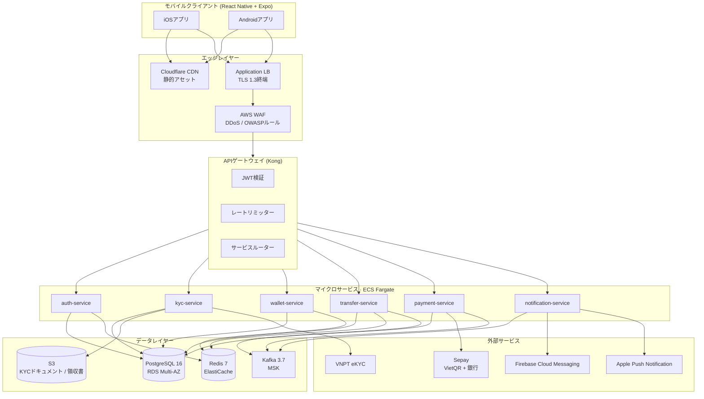
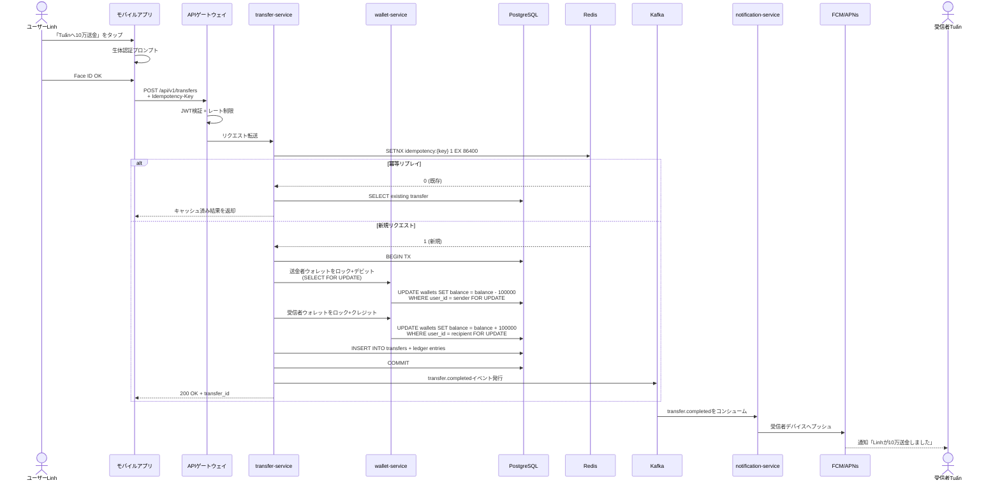

# VietPay — システムアーキテクチャ

**バージョン:** 1.0 · **日付:** 2026-05-02 · **作成者:** Planner Agent
**ステータス:** Engineering Lead 承認済み

---

## 1. ハイレベルアーキテクチャ



---

## 2. サービス責務

| サービス | 責務 | 保有データ |
|---------|----------------|-----------|
| **auth-service** | OTP送信／検証・JWT発行・セッション管理・生体認証登録・PIN | `users`、`sessions`、`device_keys` |
| **kyc-service** | eKYCフロー・OCR + ライブネス・手動レビューキュー・ドキュメント保管 | `kyc_records`、`kyc_documents` (S3) |
| **wallet-service** | ウォレットCRUD・残高照会・複式簿記レジャー | `wallets`、`wallet_balances` |
| **transfer-service** | P2P送金ロジック・冪等性・レジャーエントリ・日次限度額チェック | `transfers`、`idempotency_keys` |
| **payment-service** | Sepay統合・VietQR生成／パース・銀行Webhookレシーバー | `payments`、`qr_codes`、`webhooks` |
| **notification-service** | プッシュ通知 (FCM/APNs)・アプリ内インボックス・設定 | `notifications`、`notification_prefs` |

**パターン:** サービスごとのデータベース構成となります。共有DBスキーマはございません。サービス間クエリはAPIまたはイベント経由で実施いたします。

---

## 3. 通信パターン

### 3.1 同期 (REST)
- クライアント → APIゲートウェイ → サービス (HTTPS / TLS 1.3)
- サービス → サービスはVPC内部のmTLSで通信いたします

### 3.2 非同期 (Kafka)
**イベントトピック:**
- `transfer.created` — debit+creditコミット後にtransfer-serviceが発行
- `transfer.completed` — 決済確定後に発行（受信者向け）
- `payment.qr.scanned` — ユーザーがVietQRをスキャンした際に発行
- `payment.webhook.received` — Sepay Webhook
- `notification.requested` — プッシュ通知リクエスト（notification-serviceがコンシューム）
- `kyc.completed` — eKYC通過後
- `kyc.rejected` — eKYC失敗後（手動レビュー用）

**コンシューマー:** 各サービスが該当トピックをコンシュームいたします。At-least-once配信、コンシューマー側でデデュープを実施いたします。

---

## 4. データフロー — P2P送金（クリティカルパス）



**レイテンシ予算:**
- モバイル → ゲートウェイ：30ms
- ゲートウェイ → transfer-service：5ms
- 冪等性チェック (Redis)：2ms
- DBトランザクション（debit + credit + insert）：30ms
- Kafka発行：10ms
- 合計：約80〜100ms p50、目標 < 200ms p95

---

## 5. データベーススキーマ（ハイレベル）

### auth-service
```sql
users (id PK, phone UNIQUE, pin_hash, kyc_status, created_at, ...)
sessions (id PK, user_id FK, refresh_token_hash, device_id, expires_at, ...)
device_keys (id PK, user_id FK, public_key, biometric_enabled, ...)
```

### kyc-service
```sql
kyc_records (id PK, user_id, status [pending|approved|rejected|manual], confidence, ...)
kyc_documents (id PK, kyc_id FK, type [cmnd_front|cmnd_back|selfie], s3_key, ...)
```

### wallet-service
```sql
wallets (id PK, user_id FK, currency CHAR(3), balance BIGINT CHECK >=0, status, ...)
ledger_entries (id PK, wallet_id FK, transaction_id, amount, direction [debit|credit], ...)
```

### transfer-service
```sql
transfers (id PK, from_user, to_user, amount, currency, status, idem_key UNIQUE, ...)
idempotency_keys (key PK, response_body JSONB, created_at, expires_at)
```

### payment-service
```sql
payments (id PK, user_id, type [topup|withdraw|qr], amount, sepay_ref, status, ...)
qr_codes (id PK, user_id, type [static|dynamic], amount, expires_at, qr_string, ...)
webhooks (id PK, source [sepay|vnpay], payload JSONB, signature, processed_at, ...)
```

### notification-service
```sql
notifications (id PK, user_id, type, title, body, data JSONB, read_at, ...)
notification_prefs (user_id PK, transfer_in BOOL, transfer_out BOOL, security BOOL, ...)
```

**インデックス:** 時系列クエリ用に `(user_id, created_at DESC)` を設定いたします。カーソルページネーションを採用し、OFFSETは使用しません。

---

## 6. キャッシュ戦略

| キャッシュ | キー | TTL | 無効化 |
|-------|-----|-----|--------------|
| ウォレット残高 | `wallet:{user_id}` | 30秒 | 送金／チャージ時に無効化 |
| ユーザープロファイル | `user:{id}` | 5分 | プロファイル更新時に無効化 |
| 銀行リスト | `banks:vn` | 1時間 | 銀行リスト更新時に手動 |
| 冪等性キー | `idem:{key}` | 24時間 | 自動失効 |
| レート制限ウィンドウ | `rl:{user}:{endpoint}` | 1分 | 自動失効 |
| OTPコード | `otp:{phone}` | 5分 | 自動失効／一回限り使用 |

**Redisクラスター:** マスター3 + レプリカ3、フェイルオーバー用にSentinelを構成いたします。

---

## 7. セキュリティアーキテクチャ

### 7.1 多層防御
```
[Cloudflare CDN + DDoS]
        ↓
[AWS WAF — OWASPルール + カスタム]
        ↓
[ALB — TLS 1.3終端]
        ↓
[VPCプライベートサブネット — サービス群]
        ↓
[データベース / Redis — セキュリティグループ、パブリックアクセスなし]
```

### 7.2 認証
- JWTアクセストークン（15分）+ リフレッシュトークン（30日ローリング）
- リフレッシュトークンは使用ごとにローテーション、盗難疑い時はチェーンを失効
- 登録時に生成する公開鍵／秘密鍵ペアによるデバイスバインディング

### 7.3 暗号化
- **保存時:** AES-256-GCM（DB + S3 + Redisスナップショット）AWS KMS経由
- **通信時:** クライアント／サーバー間TLS 1.3、サービス間mTLS
- **PIIフィールド:** カラムレベル暗号化（Postgres pgcrypto）
- **KYCドキュメント:** S3 + KMS + オブジェクトロック（SBV（ベトナム国家銀行）規定により5年保管）

### 7.4 シークレット管理
- 認証情報はAWS Secrets Managerで管理
- KMS暗号化されたenvファイルをS3に格納
- コード／git／コンテナイメージ内にシークレットを含めない
- ローテーション：DBパスワード90日、APIキーはベンダーSLAに準拠

---

## 8. オブザーバビリティ

| レイヤー | ツール | 目的 |
|-------|------|---------|
| メトリクス | DataDog | サービスごとのREDメトリクス（Rate, Errors, Duration） |
| ログ | DataDog logs | 構造化JSON、30日保管 |
| トレース | DataDog APM | OpenTelemetryによる分散トレーシング |
| エラー | Sentry | クラッシュレポート、モバイル + バックエンド |
| 稼働監視 | DataDog Synthetics | 5リージョンからのエンドポイント監視 |
| アラート | PagerDuty | オンコールローテーション、重大度1〜4 |

**SLOダッシュボード:**
- サービス可用性（99.9%目標）
- APIレイテンシ p50/p95/p99
- エラーバジェット消費率
- トランザクション成功率（≥ 99.5%目標）

---

## 9. デプロイメントトポロジー

### 9.1 リージョン
- **プライマリ:** `ap-southeast-1`（シンガポール）— VNユーザー向け（低レイテンシ、サイゴン〜シンガポール約30ms）
- **セカンダリ:** `eu-central-1`（フランクフルト）— EU在住者 / DRバックアップ向け

### 9.2 リージョン別スタック
```
VPC (10.0.0.0/16)
├── パブリックサブネット — ALB、NAT GW
├── プライベートサブネット (3 AZ)
│   ├── ECS Fargateタスク（オートスケーリング 2〜20）
│   ├── RDS PostgreSQL Multi-AZ
│   ├── ElastiCache Redisクラスター
│   └── MSK Kafkaブローカー（3ノード）
└── 隔離サブネット — Secrets Manager VPCエンドポイント
```

### 9.3 CI/CD
- **ソース:** GitHub
- **CI:** GitHub Actions — lint・test・コンテナイメージビルド・ECRへプッシュ
- **CD:** AWS CodeDeploy → ECS Blue/Green
- **モバイル:** Expo EAS → TestFlight (iOS) + Play Store内部トラック (Android)
- **承認ゲート:** プロダクションデプロイにはPRレビュー2名 + CI通過 + 手動QAサインオフを必須といたします

---

## 10. ディザスタリカバリ

| シナリオ | 戦略 | RTO | RPO |
|----------|----------|-----|-----|
| 単一AZ障害 | Multi-AZ RDS自動フェイルオーバー、ECS再スケジュール | < 5分 | < 1分 |
| リージョン障害 | eu-central-1へ昇格、DNSフェイルオーバー (Route 53) | < 30分 | < 5分 |
| データベース破損 | ポイントインタイムリストア (PITR) | < 1時間 | < 5分 |
| Sepay障害 | リクエストキューイング、指数バックオフでリトライ、ユーザー通知 | N/A | 0 |
| 認証情報漏洩 | KMSキーローテーション、全セッション強制ログアウト | < 15分 | 0 |

**バックアップ:**
- RDS自動バックアップ、35日保管
- S3クロスリージョンレプリケーション（KYCドキュメント）
- データベーススナップショット日次、暗号化、1年保管

---

## 11. コスト試算（月次、50k MAU）

| リソース | コスト (USD) |
|----------|-----------|
| ECS Fargate（タスク平均12） | $850 |
| RDS PostgreSQL Multi-AZ (db.r6g.xlarge) | $720 |
| ElastiCache Redis (cache.r6g.large × 3) | $540 |
| MSK Kafka (kafka.m5.large × 3) | $480 |
| S3 + CloudFront | $180 |
| DataDog | $400 |
| Sepay手数料（約50kトランザクション） | $250 |
| VNPT eKYC（新規ユーザー約2k） | $100 |
| Cloudflare | $50 |
| **合計** | **約$3,570** |

スケーリング試算：本規模で約$0.07 / MAU / 月、500k MAUスケールでは約$0.04まで低下する見込みでございます。

---

## 12. スケーリング計画

| ステージ | MAU | アクション |
|-------|-----|--------|
| MVPローンチ | 0〜10k | 単一リージョン、ベースラインインフラ |
| 成長期 | 10k〜100k | オートスケーリング始動、リードレプリカ追加 |
| スケールアップ | 100k〜500k | eu-central-1をアクティブ化、シャーディング準備 |
| 大規模 | 500k〜1M+ | user_idによるDBシャーディング、Kafkaクラスタースケール |

---

## 未解決の質問

- VNトラフィック向けにマルチリージョンActive-Activeが必要か、それとも1M MAUまではプライマリのみのap-southeast-1で足りるか？
- シャーディング戦略：user_idハッシュ vs 地理的分割？（200k MAU時点で決定）
- コスト最適化：500kスケール時にDataDogからセルフホスト型Grafana + Loki + Tempoへ移行するか？
