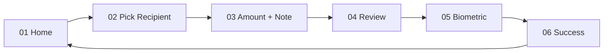

# Wireframe — P2P Transfer Flow

**Screens:** 6 · **Target time:** < 30s end-to-end · **Critical UX:** trust + speed
**Figma:** `vietpay-mvp / P2P Transfer`

---

## Flow Overview



---

## Screen 01 — Home / Quick Action

```
┌────────────────────────────────────────┐
│  Chào, Linh 👋          🔔   [avatar]  │
├────────────────────────────────────────┤
│                                        │
│   ┌──────────────────────────────────┐ │
│   │  Số dư khả dụng                  │ │
│   │                                  │ │
│   │  ₫ 2,450,000                     │ │
│   │                                  │ │
│   │  💳 VCB ****1234                 │ │
│   └──────────────────────────────────┘ │
│                                        │
│   Hành động nhanh                      │
│   ┌──────┬──────┬──────┬──────┐        │
│   │  ↑   │  ↓   │  📷  │  ⊕  │        │
│   │ Gửi  │ Nhận │ Quét │ Topup│        │
│   └──────┴──────┴──────┴──────┘        │
│                                        │
│   Giao dịch gần đây        Xem tất cả  │
│   ┌──────────────────────────────────┐ │
│   │ 🛒 Coffee House       -45,000   │  │
│   │    Hôm nay 10:23                 │ │
│   ├──────────────────────────────────┤ │
│   │ 🍔 Tuấn Nguyễn        +200,000  │  │
│   │    Hôm qua 19:45                 │ │
│   ├──────────────────────────────────┤ │
│   │ 💡 EVN Hà Nội         -380,000  │  │
│   │    25/04                         │ │
│   └──────────────────────────────────┘ │
│                                        │
│  ┌──────┬──────┬──────┬──────┐         │
│  │ Home │Wallet│  +   │ Hist │ Profile│
│  └──────┴──────┴──────┴──────┘         │
└────────────────────────────────────────┘
```

**Tap "Gửi"** → Screen 02

---

## Screen 02 — Pick Recipient

```
┌────────────────────────────────────────┐
│  ← Gửi tiền                            │
├────────────────────────────────────────┤
│                                        │
│   ┌────────────────────────────────┐   │
│   │ 🔍  Số ĐT, tên, số TK ngân hàng │   │
│   └────────────────────────────────┘   │
│                                        │
│   Tab pickers                          │
│   ┌────────┬────────┬────────┐         │
│   │ VietPay│ Bank TK│  QR    │         │
│   └────────┴────────┴────────┘         │
│   ──────                               │
│                                        │
│   Gần đây                              │
│   ┌──────────────────────────────────┐ │
│   │ [👤] Tuấn Nguyễn                  │ │
│   │      0901 234 567                 │ │
│   ├──────────────────────────────────┤ │
│   │ [👤] Mai Linh                     │ │
│   │      0987 654 321                 │ │
│   ├──────────────────────────────────┤ │
│   │ [👤] Bố                           │ │
│   │      0912 345 678                 │ │
│   └──────────────────────────────────┘ │
│                                        │
│   Danh bạ                       Cấp    │
│   quyền truy cập danh bạ →             │
│                                        │
└────────────────────────────────────────┘
```

**Tab "Bank TK":** input số tài khoản + chọn ngân hàng từ list 10 banks
**Tab "QR":** mở QR scanner (skip sang flow VietQR scan)

---

## Screen 03 — Amount + Note

```
┌────────────────────────────────────────┐
│  ← Gửi tới                             │
├────────────────────────────────────────┤
│                                        │
│   ┌──────────────────────────────────┐ │
│   │ [👤] Tuấn Nguyễn                  │ │
│   │      0901 234 567 · VietPay      │ │
│   └──────────────────────────────────┘ │
│                                        │
│   Số tiền                              │
│                                        │
│             ₫ 0                        │
│                                        │
│   Số dư khả dụng: ₫ 2,450,000          │
│                                        │
│   Gợi ý số tiền                        │
│   ┌──────┬──────┬──────┬──────┐        │
│   │ 50k  │ 100k │ 200k │ 500k │        │
│   └──────┴──────┴──────┴──────┘        │
│                                        │
│   Ghi chú (tùy chọn)                   │
│   ┌──────────────────────────────────┐ │
│   │ ☕ Trả tiền cafe sáng           │ │
│   └──────────────────────────────────┘ │
│   45/256                               │
│                                        │
│  ┌──────────────────────────────────┐  │
│  │            Tiếp tục              │  │
│  └──────────────────────────────────┘  │
│                                        │
└────────────────────────────────────────┘
```

**Validation:** số tiền ≥ 10k VND, ≤ 10M VND/lần. Disable nếu vượt balance + daily limit.

---

## Screen 04 — Review & Confirm

```
┌────────────────────────────────────────┐
│  ← Xác nhận giao dịch                  │
├────────────────────────────────────────┤
│                                        │
│         Bạn sẽ gửi                     │
│                                        │
│         ₫ 100,000                      │
│                                        │
│   ┌──────────────────────────────────┐ │
│   │ Tới                              │ │
│   │   Tuấn Nguyễn                    │ │
│   │   0901 234 567                   │ │
│   ├──────────────────────────────────┤ │
│   │ Từ                               │ │
│   │   Ví VietPay (Linh)              │ │
│   │   ₫ 2,450,000                    │ │
│   ├──────────────────────────────────┤ │
│   │ Phí                              │ │
│   │   Miễn phí                       │ │
│   ├──────────────────────────────────┤ │
│   │ Ghi chú                          │ │
│   │   ☕ Trả tiền cafe sáng         │ │
│   └──────────────────────────────────┘ │
│                                        │
│   Số dư sau giao dịch                  │
│   ₫ 2,350,000                          │
│                                        │
│  ┌──────────────────────────────────┐  │
│  │     Xác nhận với Face ID 👆       │  │
│  └──────────────────────────────────┘  │
│                                        │
│         Hủy                            │
│                                        │
└────────────────────────────────────────┘
```

**Tap confirm** → trigger biometric prompt (system-level)

---

## Screen 05 — Biometric Prompt

```
┌────────────────────────────────────────┐
│                                        │
│             [System dialog]            │
│                                        │
│         ┌─────────────────────┐        │
│         │                     │        │
│         │   VietPay muốn      │        │
│         │   xác thực giao dịch│        │
│         │                     │        │
│         │       [Face ID]     │        │
│         │                     │        │
│         │   Nhìn vào camera   │        │
│         │                     │        │
│         │                     │        │
│         │   Sử dụng PIN       │        │
│         │   Hủy               │        │
│         └─────────────────────┘        │
│                                        │
│                                        │
│                                        │
│         (background blurred)           │
│                                        │
└────────────────────────────────────────┘
```

**Loading state** sau khi biometric pass:

```
┌────────────────────────────────────────┐
│                                        │
│                                        │
│                                        │
│         ⟳  Đang xử lý...               │
│                                        │
│         Giao dịch sẽ hoàn tất          │
│         trong vài giây                 │
│                                        │
│                                        │
│                                        │
└────────────────────────────────────────┘
```

---

## Screen 06 — Success

```
┌────────────────────────────────────────┐
│                                        │
│         ┌──────────────┐               │
│         │              │               │
│         │   ✓  (anim)  │               │
│         │              │               │
│         └──────────────┘               │
│                                        │
│         Gửi thành công!                │
│                                        │
│         ₫ 100,000                      │
│         tới Tuấn Nguyễn                │
│                                        │
│   ┌──────────────────────────────────┐ │
│   │ Mã giao dịch                     │ │
│   │ #VTP-260505-A3F2C1               │ │
│   │                                  │ │
│   │ Thời gian                        │ │
│   │ 05/05/2026 11:23:45              │ │
│   │                                  │ │
│   │ Số dư còn                        │ │
│   │ ₫ 2,350,000                      │ │
│   └──────────────────────────────────┘ │
│                                        │
│  ┌──────────────────────────────────┐  │
│  │       Chia sẻ biên lai           │  │
│  └──────────────────────────────────┘  │
│                                        │
│  ┌──────────────────────────────────┐  │
│  │           Xong                   │  │
│  └──────────────────────────────────┘  │
│                                        │
└────────────────────────────────────────┘
```

**Cancellable trong 30s:** floating "Hủy giao dịch" button (chỉ hiện cho VietPay→VietPay, không bank)

---

## Edge Cases

| Case | Behavior |
|------|----------|
| Recipient không phải VietPay user | Auto-suggest "Gửi qua bank account" |
| Insufficient balance | Disable "Tiếp tục" + suggest top-up |
| Biometric fail 3 lần | Fallback PIN entry |
| Network drop trong submit | Show "Đang kiểm tra..." + retry với same Idempotency-Key |
| Daily limit exceed | Show error + show used / remaining limit |
| Recipient blocked / inactive | Show error "Không thể gửi tới user này" |

---

## Analytics Events

- `transfer_flow_started`
- `transfer_recipient_picked` (source: recent / contacts / search / qr)
- `transfer_amount_entered` (amount range bucket)
- `transfer_review_shown`
- `transfer_biometric_prompted`
- `transfer_success` (latency_ms, amount_bucket)
- `transfer_failed` (error_code)
