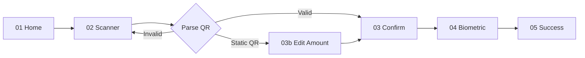

# Wireframe — VietQR Scan & Pay Flow

**Screens:** 5 · **Target time:** < 15s scan-to-pay · **Critical UX:** speed + clear merchant info
**Figma:** `vietpay-mvp / VietQR Scan`

---

## Flow Overview



---

## Screen 01 — Entry Point (Home)

User tap "📷 Quét" trên Home screen → mở camera scanner.

---

## Screen 02 — QR Scanner

```
┌────────────────────────────────────────┐
│  ✕                              💡 🖼  │
├────────────────────────────────────────┤
│                                        │
│                                        │
│      ┌─────────────────────────┐       │
│      │ ┌──┐               ┌──┐ │       │
│      │ │  │   [Camera]    │  │ │       │
│      │ └──┘   viewfinder  └──┘ │       │
│      │                         │       │
│      │       Hướng QR          │       │
│      │       vào khung         │       │
│      │                         │       │
│      │ ┌──┐               ┌──┐ │       │
│      │ │  │               │  │ │       │
│      │ └──┘               └──┘ │       │
│      └─────────────────────────┘       │
│                                        │
│                                        │
│   Quét VietQR để thanh toán nhanh      │
│                                        │
│                                        │
│   ┌────────┬────────┐                  │
│   │ 🖼 Tải│ ⌨ Nhập │                  │
│   │  ảnh   │ thủ công│                 │
│   └────────┴────────┘                  │
│                                        │
└────────────────────────────────────────┘
```

**Behavior:**
- Auto-detect QR ở center frame, vibrate khi detect
- Nút 💡 toggle flash (low-light)
- Nút 🖼 chọn ảnh QR từ thư viện
- Nút ⌨ fallback nhập thủ công (account number + bank)

**Animation:** scan line animation di chuyển dọc khung. Khi detect, frame highlight màu xanh `#00B074`.

---

## Screen 03 — Confirm Payment (Dynamic QR — has amount)

```
┌────────────────────────────────────────┐
│  ✕  Xác nhận thanh toán                │
├────────────────────────────────────────┤
│                                        │
│   ┌──────────────────────────────────┐ │
│   │                                  │ │
│   │       [Merchant logo]            │ │
│   │                                  │ │
│   │       Coffee House               │ │
│   │       228 Lê Lợi, Q1, HCM        │ │
│   │                                  │ │
│   └──────────────────────────────────┘ │
│                                        │
│   Số tiền                              │
│                                        │
│             ₫ 65,000                   │
│                                        │
│   ┌──────────────────────────────────┐ │
│   │ Mã đơn                           │ │
│   │   ORD-20260505-1123               │ │
│   ├──────────────────────────────────┤ │
│   │ Ngân hàng nhận                   │ │
│   │   Vietcombank ****5678           │ │
│   ├──────────────────────────────────┤ │
│   │ Phí                              │ │
│   │   Miễn phí                       │ │
│   └──────────────────────────────────┘ │
│                                        │
│   Thanh toán từ                        │
│   ┌──────────────────────────────────┐ │
│   │ ⚪  Ví VietPay      ₫ 2,450,000   │ │
│   │ ○  VCB ****1234    ₫ 8,200,000   │ │
│   └──────────────────────────────────┘ │
│                                        │
│  ┌──────────────────────────────────┐  │
│  │     Xác nhận với Face ID 👆       │  │
│  └──────────────────────────────────┘  │
│                                        │
└────────────────────────────────────────┘
```

**Behavior:** Highlight merchant info to prevent fraud (user thấy rõ trả ai, bao nhiêu).

---

## Screen 03b — Edit Amount (Static QR — no amount)

```
┌────────────────────────────────────────┐
│  ✕  Nhập số tiền                       │
├────────────────────────────────────────┤
│                                        │
│   ┌──────────────────────────────────┐ │
│   │       Coffee House               │ │
│   │       Vietcombank ****5678       │ │
│   └──────────────────────────────────┘ │
│                                        │
│   Số tiền cần thanh toán               │
│                                        │
│             ₫ 0                        │
│                                        │
│   Gợi ý                                │
│   ┌──────┬──────┬──────┬──────┐        │
│   │ 50k  │ 100k │ 200k │ 500k │        │
│   └──────┴──────┴──────┴──────┘        │
│                                        │
│   Ghi chú (tùy chọn)                   │
│   ┌──────────────────────────────────┐ │
│   │ ☕ 1 latte + 1 cake             │ │
│   └──────────────────────────────────┘ │
│                                        │
│  ┌──────────────────────────────────┐  │
│  │            Tiếp tục              │  │
│  └──────────────────────────────────┘  │
│                                        │
└────────────────────────────────────────┘
```

→ Sau đó tới Screen 03 (Confirm) như flow dynamic QR

---

## Screen 04 — Biometric Confirm

```
┌────────────────────────────────────────┐
│                                        │
│             [System dialog]            │
│                                        │
│         ┌─────────────────────┐        │
│         │                     │        │
│         │   VietPay muốn      │        │
│         │   xác thực thanh    │        │
│         │   toán ₫ 65,000     │        │
│         │                     │        │
│         │       [Face ID]     │        │
│         │                     │        │
│         │   Nhìn vào camera   │        │
│         │                     │        │
│         │   Sử dụng PIN       │        │
│         │   Hủy               │        │
│         └─────────────────────┘        │
│                                        │
└────────────────────────────────────────┘
```

**Loading state:**

```
┌────────────────────────────────────────┐
│                                        │
│         ⟳  Đang thanh toán...          │
│                                        │
│         Vui lòng không tắt app         │
│                                        │
└────────────────────────────────────────┘
```

---

## Screen 05 — Success

```
┌────────────────────────────────────────┐
│                                        │
│         ┌──────────────┐               │
│         │              │               │
│         │   ✓  (anim)  │               │
│         │              │               │
│         └──────────────┘               │
│                                        │
│         Thanh toán thành công!         │
│                                        │
│         ₫ 65,000                       │
│         tới Coffee House               │
│                                        │
│   ┌──────────────────────────────────┐ │
│   │ Mã giao dịch                     │ │
│   │ #VTP-260505-B7E4D9               │ │
│   │                                  │ │
│   │ Thời gian                        │ │
│   │ 05/05/2026 11:24:12              │ │
│   │                                  │ │
│   │ Mã đơn (merchant)                │ │
│   │ ORD-20260505-1123                │ │
│   │                                  │ │
│   │ Số dư còn                        │ │
│   │ ₫ 2,385,000                      │ │
│   └──────────────────────────────────┘ │
│                                        │
│  ┌──────────────────────────────────┐  │
│  │       Tải biên lai PDF           │  │
│  └──────────────────────────────────┘  │
│                                        │
│  ┌──────────────────────────────────┐  │
│  │           Xong                   │  │
│  └──────────────────────────────────┘  │
│                                        │
│        Quét mã khác                    │
│                                        │
└────────────────────────────────────────┘
```

**"Quét mã khác"** quay lại Screen 02 nhanh — useful cho merchant scenario.

---

## Edge Cases

| Case | Behavior |
|------|----------|
| QR không phải VietQR EMV format | Show "QR không hợp lệ" + suggest manual entry |
| QR expired (dynamic, > 15 min) | Show "Mã QR đã hết hạn, vui lòng yêu cầu mã mới" |
| Camera permission denied | Modal hỏi grant + fallback "Chọn ảnh từ thư viện" |
| Insufficient balance | Show available balance + suggest topup hoặc switch sang VCB direct |
| Merchant blocked (fraud list) | Block payment + escalate to security team |
| Network slow | "Đang xác minh..." spinner > 5s, retry button > 10s |
| Static QR without amount → user nhập 0 | Validation error "Số tiền phải > 0" |

---

## Generate QR (Receive) — Companion Flow

User tap "↓ Nhận" trên Home → mở Receive screen:

```
┌────────────────────────────────────────┐
│  ← Nhận tiền                           │
├────────────────────────────────────────┤
│                                        │
│   Tab pickers                          │
│   ┌────────┬────────┐                  │
│   │ QR cố  │ QR có  │                  │
│   │ định   │ số tiền│                  │
│   └────────┴────────┘                  │
│   ──────                               │
│                                        │
│   ┌──────────────────────────────────┐ │
│   │                                  │ │
│   │       [VietQR code]              │ │
│   │                                  │ │
│   │     ▆▆▆ ▆▆ ▆▆▆▆ ▆▆               │ │
│   │     ▆ ▆ ▆▆ ▆ ▆▆ ▆                │ │
│   │     ▆▆▆▆▆ ▆▆▆ ▆▆▆▆               │ │
│   │     ▆ ▆▆ ▆▆▆▆ ▆▆▆ ▆               │ │
│   │     ▆▆▆ ▆▆ ▆▆▆▆ ▆▆               │ │
│   │                                  │ │
│   └──────────────────────────────────┘ │
│                                        │
│        Linh Nguyễn                     │
│        VCB ****1234                    │
│                                        │
│   ┌──────────────────────────────────┐ │
│   │ 📤 Chia sẻ                       │ │
│   ├──────────────────────────────────┤ │
│   │ 💾 Tải ảnh QR                   │ │
│   ├──────────────────────────────────┤ │
│   │ 🖨 In QR (cho merchant)          │ │
│   └──────────────────────────────────┘ │
│                                        │
└────────────────────────────────────────┘
```

**Tab "QR có số tiền":** input amount + note → generate dynamic QR với 15-phút expiry

---

## Analytics Events

- `qr_scanner_opened` (entry: home / dialog / deeplink)
- `qr_detected` (qr_type: dynamic / static, parse_time_ms)
- `qr_invalid` (reason)
- `qr_payment_confirmed` (amount_bucket)
- `qr_payment_success` (latency_ms)
- `qr_payment_failed` (error_code)
- `qr_generate_static`
- `qr_generate_dynamic` (amount_bucket)
- `qr_share` (channel: zalo / messenger / save_image / system)
