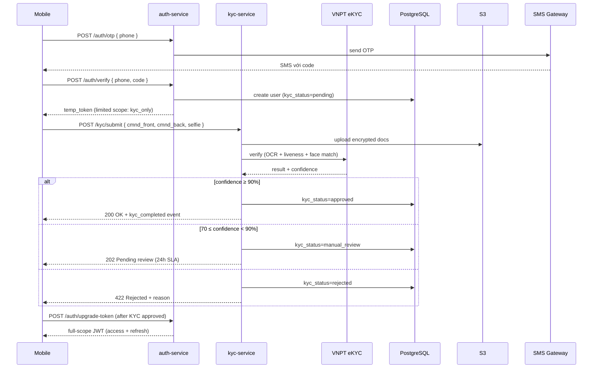

# Phase 02 — Auth + eKYC

**Duration:** Week 2-3 (2026-05-13 → 2026-05-26) · **Priority:** P0 ⚡ Critical · **Status:** Not started
**Owner:** Backend Lead · **Team:** 4 backend devs + 3 mobile devs + 1 designer + 1 QA

---

## Context Links

- [Master Plan](plan.md) · [SRS FR-001, FR-002, FR-011, FR-012](../../docs/srs.md) · [Onboarding Wireframe](../../docs/wireframes/onboarding-flow.md)
- [Researcher Report — VNPT eKYC](research/researcher-02-vnpt-ekyc.md)

## Overview

Build user registration + authentication + eKYC verification flow E2E. Foundation cho mọi feature sau — không user authenticated thì không thể transfer / pay / view history.

## Key Insights

- **VNPT eKYC** chosen over FPT (cost 0.05 vs 0.08 USD, accuracy 97.2% vs 95.8%, latency tương đương)
- KYC data lưu **5 năm** per SBV Circular 23/2019
- Manual review queue cần thiết cho 5-8% rejected cases để boost approval rate
- Refresh token rotation + device binding để chống token theft
- Biometric **không** lưu server side, chỉ dùng để unlock encrypted local key

## Requirements

### Functional
- FR-001: register via phone + OTP, set 6-digit PIN
- FR-002: eKYC CMND/CCCD scan + selfie liveness, encrypted storage
- FR-011: biometric auth (Face ID / Fingerprint), fallback PIN
- FR-012: change PIN, logout all, delete account flow

### Non-functional
- OTP delivery < 30s (95th percentile)
- eKYC pass rate ≥ 92% auto (≥ 98% with manual review)
- KYC encryption AES-256-GCM at rest
- Audit log mọi truy cập KYC data, immutable

## Architecture

## Related Code Files

### Create — Backend
- `services/auth-service/` (NestJS module skeleton)
  - `src/modules/otp/otp.service.ts`
  - `src/modules/otp/otp.controller.ts`
  - `src/modules/users/users.service.ts`
  - `src/modules/users/users.controller.ts`
  - `src/modules/jwt/jwt.service.ts` (token issue + refresh rotation)
  - `src/modules/biometric/biometric.service.ts`
- `services/kyc-service/`
  - `src/modules/kyc/kyc.service.ts`
  - `src/modules/kyc/kyc.controller.ts`
  - `src/adapters/vnpt-ekyc.adapter.ts`
  - `src/adapters/sms-gateway.adapter.ts`
  - `src/modules/manual-review/manual-review.service.ts`
- `migrations/20260513_001_create_users_table.sql`
- `migrations/20260513_002_create_sessions_table.sql`
- `migrations/20260513_003_create_device_keys_table.sql`
- `migrations/20260514_001_create_kyc_records_table.sql`
- `migrations/20260514_002_create_kyc_documents_table.sql`

### Create — Mobile
- `mobile/screens/onboarding/WelcomeScreen.tsx`
- `mobile/screens/onboarding/PhoneScreen.tsx`
- `mobile/screens/onboarding/OTPScreen.tsx`
- `mobile/screens/onboarding/EKYCIntroScreen.tsx`
- `mobile/screens/onboarding/IDScanScreen.tsx`
- `mobile/screens/onboarding/SelfieScreen.tsx`
- `mobile/screens/onboarding/SetPinScreen.tsx`
- `mobile/screens/onboarding/BiometricScreen.tsx`
- `mobile/services/auth.api.ts`
- `mobile/services/kyc.api.ts`
- `mobile/services/biometric.service.ts` (expo-local-authentication wrapper)
- `mobile/services/secure-storage.service.ts` (expo-secure-store wrapper)

## Implementation Steps

### Step 1 — Database schema (1 day)
Migrations cho `users`, `sessions`, `device_keys`, `kyc_records`, `kyc_documents`. Add column-level encryption pgcrypto cho PII (full_name, ID number).

### Step 2 — Auth service core (3 days)
1. OTP service: generate + store Redis 5min TTL + send qua SMS gateway (Stringee)
2. Verify OTP, create user record
3. JWT issue (access 15min + refresh 30day rolling)
4. Refresh token rotation: revoke chain on detection of theft

### Step 3 — eKYC integration (4 days)
1. VNPT eKYC adapter: OCR CMND/CCCD, liveness, face match
2. S3 upload encrypted docs (KMS-managed key per record)
3. Manual review queue UI (admin tool — internal)
4. Audit log mọi truy cập docs (CloudWatch + DataDog)

### Step 4 — Biometric flow (2 days)
1. expo-local-authentication wrapper
2. Generate device keypair (RSA-2048), public key gửi server
3. Sign challenge với private key cho biometric login
4. Fallback PIN nếu biometric fail 3 lần hoặc thiết bị không support

### Step 5 — Mobile screens (4 days, parallel với backend)
- 8 screens onboarding theo wireframe
- React Hook Form + Zod validation
- expo-camera cho ID scan + selfie
- Auto-fill OTP từ SMS (iOS / Android API)

### Step 6 — Integration test + QA (2 days)
- E2E flow happy path: phone → OTP → KYC → biometric → done
- Edge cases: KYC reject, OTP expire, biometric not available
- Load test: 1000 concurrent OTP requests

## Todo List

### Backend
- [ ] DB migrations (5 tables)
- [ ] OTP service (generate + send + verify)
- [ ] SMS gateway adapter (Stringee)
- [ ] User registration endpoint
- [ ] JWT issue + refresh rotation
- [ ] Device keypair enrollment endpoint
- [ ] Biometric challenge-response endpoint
- [ ] PIN hash + verify (Argon2id)
- [ ] Change PIN endpoint
- [ ] Logout / logout-all endpoint
- [ ] Delete account flow (30-day grace)
- [ ] VNPT eKYC adapter
- [ ] KYC submit endpoint
- [ ] S3 encrypted upload helper
- [ ] Manual review queue API
- [ ] Manual review admin UI (internal)
- [ ] Audit log middleware

### Mobile
- [ ] Welcome screen + 3 onboarding slides
- [ ] Phone entry screen + validation
- [ ] OTP screen + auto-fill
- [ ] eKYC intro screen
- [ ] ID card scan screen (camera + edge detection)
- [ ] Selfie screen + liveness UI
- [ ] Set PIN screen + confirm
- [ ] Biometric enrollment screen
- [ ] Auth API client (axios + interceptors)
- [ ] KYC API client
- [ ] Token refresh logic + queue
- [ ] Secure storage (expo-secure-store)
- [ ] Biometric service wrapper
- [ ] Error handling + retry UX

### Test
- [ ] Unit tests OTP service (rate limit, expiry, replay)
- [ ] Unit tests JWT (issue, refresh rotation, theft detection)
- [ ] Unit tests KYC adapter (mock VNPT)
- [ ] Integration tests E2E happy path
- [ ] Integration tests reject paths
- [ ] Load test 1000 concurrent OTP

## Success Criteria

- ✅ User register hoàn chỉnh trong < 5 phút (90th percentile)
- ✅ KYC auto-approve rate ≥ 92%
- ✅ Biometric login working trên iOS 14+ và Android 8+
- ✅ Code coverage ≥ 80% line cho auth-service + kyc-service
- ✅ Audit log immutable, query-able trong DataDog

## Risk Assessment

| Risk | Probability | Impact | Mitigation |
|------|:-----------:|:------:|------------|
| VNPT API down trong dev | Low | Medium | Mock adapter cho dev, contract test |
| OTP fraud (SIM swap) | Medium | High | Rate limit + CAPTCHA + risk scoring |
| KYC accuracy low cho đèn yếu | Medium | Medium | UX hint + retry, manual review fallback |
| Biometric không support đủ device | Low | Low | PIN fallback always available |
| SMS gateway delay > 30s | Low | Medium | Multi-provider fallback (Twilio backup) |

## Security Considerations

- PIN hash với Argon2id (timing-resistant)
- OTP: 6-digit, 5-min expire, max 3 attempts, rate limit 3/hour/phone
- JWT: HS256 với secret rotation 90 days
- Refresh token rotation + theft detection → revoke entire chain
- KYC docs encrypted với per-record KMS data key
- All PII encrypted column-level
- Audit log immutable (S3 object lock 1 year)
- Liveness detection prevent photo / video replay attack

## Next Steps

- Unblocks Phase 03 (Bank Linking) — needs authenticated user
- Doc impact: update [code-standards.md](../../docs/code-standards.md) với JWT pattern + auth middleware contract
