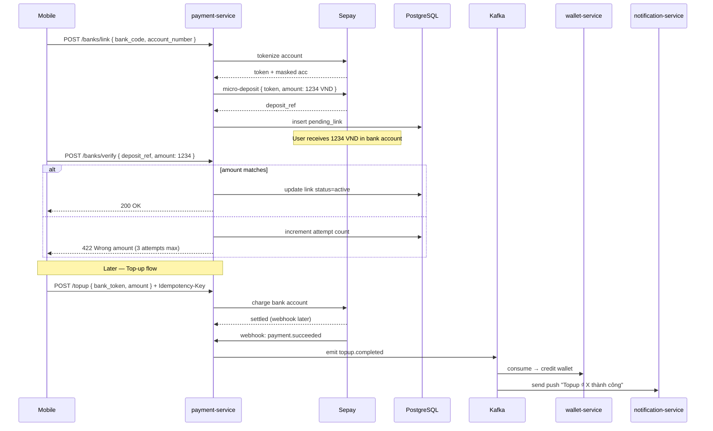

# Phase 03 — Bank Account Linking

**Duration:** Week 4 (2026-05-27 → 2026-06-02) · **Priority:** P0 ⚡ Critical · **Status:** Not started
**Owner:** Backend Lead · **Team:** 3 backend devs + 2 mobile devs + 1 designer + 1 QA

---

## Context Links

- [Master Plan](plan.md) · [SRS FR-003, FR-004](../../docs/srs.md)
- [Researcher Report — Sepay Integration](research/researcher-01-sepay-integration.md)

## Overview

User link bank account vào VietPay wallet. Verify ownership qua Sepay micro-deposit (gửi 1k-3k VND, user xác nhận số tiền). Foundation cho top-up + bank transfer ở Phase 04.

## Key Insights

- Hỗ trợ **top 10 bank VN** ở MVP (cover 87% market): Vietcombank, BIDV, VietinBank, Agribank, MB Bank, Techcombank, ACB, VPBank, TPBank, Sacombank
- Sepay tokenize account number → không lưu PAN ở VietPay → PCI-DSS scope reduce dramatically
- Micro-deposit: random 1,001 - 2,999 VND, user nhập đúng amount → verify
- Tối đa 3 bank account / user (per SRS)
- 24h grace period khi unlink — tránh accidental remove

## Requirements

### Functional
- FR-003: link bank account, verify ownership, max 3 / user, remove flow
- FR-004: top-up wallet from linked bank (min 10k, max 50M / lần, daily 100M)

### Non-functional
- Verification time < 60s (95th percentile)
- Top-up settle vào wallet < 30s
- Idempotent qua Idempotency-Key

## Architecture

## Related Code Files

### Create — Backend
- `services/payment-service/src/modules/bank-linking/bank-linking.service.ts`
- `services/payment-service/src/modules/bank-linking/bank-linking.controller.ts`
- `services/payment-service/src/modules/topup/topup.service.ts`
- `services/payment-service/src/modules/topup/topup.controller.ts`
- `services/payment-service/src/adapters/sepay.adapter.ts`
- `services/payment-service/src/webhooks/sepay-webhook.controller.ts`
- `migrations/20260527_001_create_linked_banks_table.sql`
- `migrations/20260527_002_create_pending_verifications_table.sql`
- `migrations/20260528_001_create_topups_table.sql`

### Create — Mobile
- `mobile/screens/banks/LinkedBanksScreen.tsx` (list + remove)
- `mobile/screens/banks/AddBankScreen.tsx` (bank picker + account input)
- `mobile/screens/banks/VerifyDepositScreen.tsx` (input amount)
- `mobile/screens/topup/TopUpScreen.tsx` (amount + bank picker)
- `mobile/services/banks.api.ts`
- `mobile/services/topup.api.ts`

## Implementation Steps

### Step 1 — Sepay adapter (2 days)
1. SDK wrapper với HMAC-SHA256 signature for requests
2. Tokenize, micro-deposit, charge methods
3. Webhook signature verification
4. Retry logic exponential backoff (Sepay 5xx)
5. Sandbox env testing

### Step 2 — Bank linking flow (2 days)
1. List supported banks endpoint (10 banks + logos)
2. Link bank endpoint (tokenize + initiate micro-deposit)
3. Verify deposit endpoint (3 attempts max, lockout 24h after)
4. Unlink endpoint (24h grace, soft delete)

### Step 3 — Top-up flow (2 days)
1. POST /topup endpoint với Idempotency-Key middleware
2. Charge Sepay synchronously, return pending status
3. Sepay webhook receiver (verify HMAC, dedup)
4. Kafka emit `topup.completed`
5. wallet-service consume, credit wallet via DB transaction

### Step 4 — Mobile UI (2 days, parallel)
- Bank picker với logo + brand color
- Account number formatting (auto-spaces)
- Verify deposit input + countdown timer
- Top-up amount picker + bank selector

### Step 5 — Test (1 day)
- Sepay sandbox E2E
- Idempotency replay test
- Webhook dedup test
- Wrong amount lockout test

## Todo List

### Backend
- [ ] Sepay adapter với HMAC signing
- [ ] Sepay webhook verification middleware
- [ ] DB migrations (linked_banks, pending_verifications, topups)
- [ ] Bank list endpoint (cached 1h)
- [ ] Link bank endpoint
- [ ] Verify deposit endpoint với attempt counter
- [ ] Unlink bank endpoint (soft delete + grace)
- [ ] Top-up endpoint với idempotency
- [ ] Sepay webhook receiver
- [ ] Kafka producer: `topup.completed`
- [ ] wallet-service consumer: credit wallet
- [ ] Notification trigger on success / fail

### Mobile
- [ ] Bank picker component (10 banks + logos)
- [ ] Add bank screen
- [ ] Verify deposit screen
- [ ] Linked banks list + remove flow
- [ ] Top-up screen + flow
- [ ] Top-up confirmation modal
- [ ] Success / error states + retry

### Test
- [ ] Unit tests Sepay adapter (mock)
- [ ] Unit tests bank linking service
- [ ] Integration test E2E link → verify → top-up
- [ ] Webhook signature validation tests
- [ ] Idempotency replay test
- [ ] Wrong amount lockout test

## Success Criteria

- ✅ User link 1 bank account E2E < 60s
- ✅ Top-up 100k VND completes < 30s end-to-end
- ✅ Webhook dedup zero duplicate credit
- ✅ Coverage ≥ 80% cho payment-service bank-linking + topup modules

## Risk Assessment

| Risk | Probability | Impact | Mitigation |
|------|:-----------:|:------:|------------|
| Sepay sandbox unstable | Medium | Medium | Local mock adapter cho dev, contract test |
| Webhook duplicate processing | Medium | High | Idempotency key + dedup table với 24h TTL |
| Bank account belongs to fraud / blocklist | Low | Critical | Sepay risk scoring + manual review threshold |
| Top-up race condition (double credit) | Low | Critical | DB transaction + webhook idempotency |

## Security Considerations

- Account number tokenized via Sepay, **never** lưu PAN ở VietPay DB
- Webhook signature HMAC-SHA256 mandatory
- Rate limit: link attempt 3/day/user, verify 3/link
- Audit log mọi link / unlink operation
- Lockout 24h after 3 failed verify attempts

## Next Steps

- Unblocks Phase 04 (Transfer Engine) — wallet có balance để transfer
- Doc impact: update [system-architecture.md](../../docs/system-architecture.md) với Sepay webhook flow
