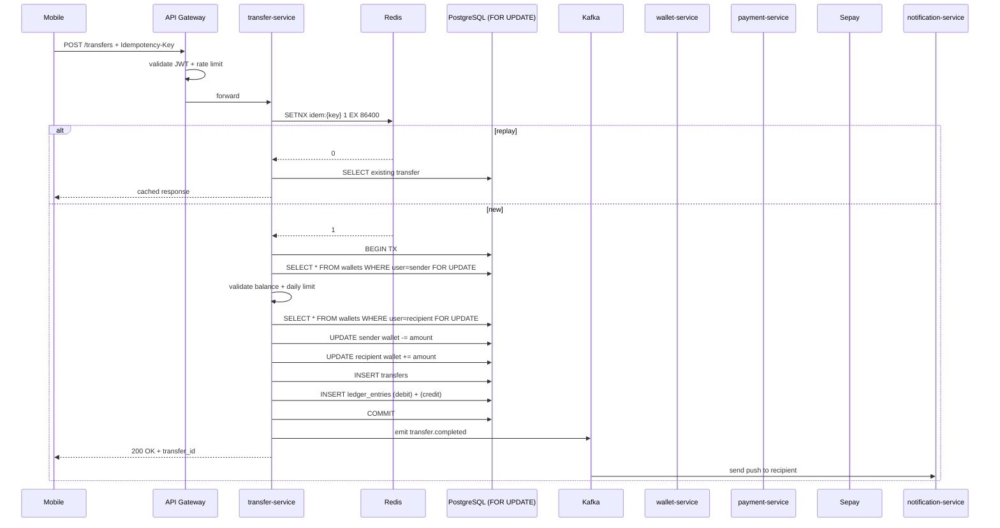

# Phase 04 — P2P Transfer Engine

**Duration:** Week 5-7 (2026-06-03 → 2026-06-23) · **Priority:** P0 ⚡ Critical · **Status:** Not started
**Owner:** Backend Lead · **Team:** 6 backend devs + 4 mobile devs + 1 designer + 1 QA

---

## Context Links

- [Master Plan](plan.md) · [SRS FR-005, FR-006](../../docs/srs.md) · [P2P Wireframe](../../docs/wireframes/p2p-transfer-flow.md)

## Overview

Build core P2P transfer engine — the heart của VietPay. Hỗ trợ 2 loại:
1. **VietPay → VietPay** (phone-based, in-app instant)
2. **VietPay → Bank account** (qua Sepay NAPAS 24/7)

Critical correctness — không được phép double-spend, lost transaction, race condition. Đây là phase nơi production sẽ test stress nhất.

## Key Insights

- **Idempotency key required** mọi mutation — server reject nếu thiếu
- **SELECT FOR UPDATE** cho wallet rows trong transaction để tránh race
- **Double-entry ledger** pattern — mỗi transfer tạo 2 ledger entries (debit + credit), sum should always be 0
- Transaction note < 256 chars, sanitize HTML để tránh stored XSS trong UI
- Cancellable trong **30s** chỉ cho VietPay → VietPay (không cho bank)
- Daily limit 100M VND check qua materialized view refresh hourly

## Requirements

### Functional
- FR-005: send VND tới VietPay user via phone, min 10k, max 10M / lần
- FR-006: send VND tới external bank account via Sepay
- Cancellable VietPay → VietPay trong 30s nếu recipient chưa "claim"
- Daily limit 100M VND / user
- Note tối đa 256 chars
- Receipt PDF generate-able cho mọi transfer

### Non-functional
- E2E latency < 3s (95th percentile) cho VietPay → VietPay
- E2E latency < 30s cho VietPay → bank (banking hours)
- API p95 < 200ms
- Zero double-spend at 1000 concurrent transfers (chaos test)
- Idempotent với 24h key TTL

## Architecture

**External bank flow** branches từ TS sang PS → Sepay async, status callback qua webhook.

## Related Code Files

### Create — Backend
- `services/transfer-service/`
  - `src/modules/transfers/transfer.service.ts` (core logic)
  - `src/modules/transfers/transfer.controller.ts`
  - `src/modules/transfers/dto/create-transfer.dto.ts`
  - `src/modules/idempotency/idempotency.service.ts`
  - `src/modules/idempotency/idempotency.middleware.ts`
  - `src/modules/limits/daily-limit.service.ts`
  - `src/modules/cancel/cancellation.service.ts`
- `services/wallet-service/`
  - `src/modules/wallets/wallet.service.ts`
  - `src/modules/wallets/ledger.service.ts`
  - `src/modules/wallets/dto/credit.dto.ts`
- `services/payment-service/src/modules/bank-transfer/bank-transfer.service.ts`
- `migrations/20260603_001_create_transfers_table.sql`
- `migrations/20260603_002_create_ledger_entries_table.sql`
- `migrations/20260603_003_create_idempotency_keys_table.sql`
- `migrations/20260604_001_create_daily_limits_view.sql` (materialized)

### Create — Mobile
- `mobile/screens/transfer/PickRecipientScreen.tsx`
- `mobile/screens/transfer/EnterAmountScreen.tsx`
- `mobile/screens/transfer/ReviewTransferScreen.tsx`
- `mobile/screens/transfer/TransferSuccessScreen.tsx`
- `mobile/services/transfers.api.ts`
- `mobile/components/AmountInput.tsx` (VND format)
- `mobile/components/RecipientPicker.tsx` (search + recent + contacts)

## Implementation Steps

### Week 1 — Core engine (5 days)
1. **Day 1-2:** DB migrations + ledger schema. Setup constraints (CHECK balance ≥ 0, FK integrity).
2. **Day 3:** Idempotency middleware (Redis SETNX + DB fallback for persistence beyond Redis TTL).
3. **Day 4:** Transfer service core: SELECT FOR UPDATE, debit, credit, ledger entries — all atomic.
4. **Day 5:** Daily limit check via materialized view, refresh on tx completion.

### Week 2 — External + cancel (5 days)
1. **Day 1-2:** Bank transfer flow qua Sepay (initiate, webhook callback for settlement).
2. **Day 3:** Cancellation flow (30s window, only VietPay → VietPay, atomic reverse).
3. **Day 4:** Receipt PDF generator (Puppeteer in lambda or pdfkit in service).
4. **Day 5:** Kafka events `transfer.created`, `transfer.completed`, `transfer.cancelled`, `transfer.failed`.

### Week 3 — Mobile + test + harden (5 days)
1. **Day 1-2:** 5 mobile screens + flow.
2. **Day 3:** Chaos testing: 1000 concurrent transfers ALL targeting same recipient (race test).
3. **Day 4:** Load test: 1000 concurrent users, mixed senders/recipients, 60s ramp-up. Validate p95 < 200ms.
4. **Day 5:** Bug fixes + integration test E2E + QA sign-off.

## Todo List

### Backend Core
- [ ] DB migration: `transfers` table với idem_key UNIQUE
- [ ] DB migration: `ledger_entries` table với CHECK direction IN ('debit', 'credit')
- [ ] DB migration: `idempotency_keys` table với expires_at index
- [ ] DB migration: `daily_limits_mv` materialized view + refresh trigger
- [ ] Idempotency middleware (Redis primary, DB fallback)
- [ ] Daily limit service (check + reserve)
- [ ] Transfer service: VietPay → VietPay (atomic transaction)
- [ ] Transfer service: VietPay → bank (async via Sepay)
- [ ] Wallet service: debit + credit primitives với SELECT FOR UPDATE
- [ ] Ledger service: insert paired entries (sum = 0 invariant)
- [ ] Cancel transfer endpoint (30s window check)
- [ ] Receipt PDF endpoint
- [ ] Kafka emit: `transfer.created`
- [ ] Kafka emit: `transfer.completed`
- [ ] Kafka emit: `transfer.cancelled`
- [ ] Kafka emit: `transfer.failed`

### Mobile
- [ ] Pick recipient screen (search + recent + contacts)
- [ ] Contacts permission flow
- [ ] Amount input với VND format + suggested amounts
- [ ] Note input với char counter
- [ ] Review transfer screen
- [ ] Biometric prompt integration
- [ ] Loading + success animation
- [ ] Cancel transfer button (countdown 30s)
- [ ] Share receipt action
- [ ] Error states + retry

### Test
- [ ] Unit tests transfer service (47 cases including edge)
- [ ] Unit tests idempotency middleware
- [ ] Unit tests daily limit
- [ ] Integration test happy path
- [ ] Integration test idempotent replay
- [ ] Integration test concurrent same-key (only 1 succeed)
- [ ] **Chaos test: 1000 concurrent transfers, validate ledger sum = 0**
- [ ] Load test 1000 concurrent (k6) — p95 < 200ms
- [ ] Cancel flow tests
- [ ] Bank transfer E2E (Sepay sandbox)

## Success Criteria

- ✅ 1000 concurrent transfers pass với zero ledger inconsistency
- ✅ Idempotency: 1000 retries với same key → exactly 1 transfer
- ✅ p95 latency < 200ms ở 1000 RPS
- ✅ E2E user flow < 3s (mobile to success screen)
- ✅ Cancel works trong 30s window, fails sau đó
- ✅ Coverage ≥ 90% cho transfer-service (highest target)
- ✅ Zero P0 bugs trong QA

## Risk Assessment

| Risk | Probability | Impact | Mitigation |
|------|:-----------:|:------:|------------|
| **Race condition double-credit** | Medium | **Critical** | SELECT FOR UPDATE + chaos test + invariant check (ledger sum = 0) |
| Idempotency Redis loss | Low | High | DB fallback table for persistence |
| Sepay timeout in flight | Medium | High | Pending state với reconciliation job mỗi 5 min |
| Daily limit race (over-spend) | Medium | High | Reserve-then-commit pattern, materialized view |
| Cancel race (recipient already spent) | Low | Medium | Cancel locks recipient wallet briefly |
| Mobile retry creates duplicate | High | High | Auto-attach Idempotency-Key UUID per submit click |

## Security Considerations

- Idempotency-Key: client-generated UUID v4, server validates format
- Note field sanitize HTML + strip control chars
- Transfer amount validate server-side (don't trust client)
- Rate limit: 30 transfers / hour / user, escalate to fraud review nếu vượt
- Audit log mọi transfer attempt (success / fail), 1-year retention
- Suspicious pattern detection: ≥ 5 transfers / minute → flag + temp lock
- AML auto-flag transfer ≥ 400M VND đơn lẻ

## Next Steps

- Unblocks Phase 05 (VietQR) — uses transfer engine for QR payment settlement
- Unblocks Phase 06 (History) — query transfers table
- Doc impact: major update [system-architecture.md](../../docs/system-architecture.md) với ledger pattern + idempotency design
- ADR document: "Why double-entry ledger over single-balance updates"
