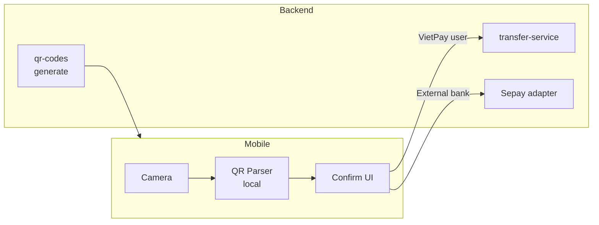

# Phase 05 — VietQR Payment

**Duration:** Week 8-9 (2026-06-24 → 2026-07-07) · **Priority:** P0 · **Status:** Not started
**Owner:** Backend Lead · **Team:** 4 backend devs + 4 mobile devs + 2 designers + 1 QA

---

## Context Links

- [Master Plan](plan.md) · [SRS FR-007, FR-008](../../docs/srs.md) · [VietQR Wireframe](../../docs/wireframes/vietqr-scan-flow.md)

## Overview

VietQR generation (receive money) + scanning (pay merchant). Build trên Phase 04 transfer engine. VietQR là chuẩn EMV của Napas, cần parse + emit đúng format để interoperate với mọi bank app VN.

## Key Insights

- **VietQR EMV format** chuẩn Napas — fix structure tag-length-value
- Static QR (no amount) — link với VietPay wallet permanent
- Dynamic QR (with amount) — expire sau 15 phút, có order ID
- QR scan: parse fast offline, không cần network để show preview
- Image upload fallback (chọn ảnh QR từ thư viện) cho scenario merchant chỉ in giấy

## Requirements

### Functional
- FR-007: generate static QR (link wallet) + dynamic QR (specific amount + expiry)
- FR-008: scan QR via camera + image upload + manual entry, parse VietQR EMV

### Non-functional
- QR scan parse < 100ms offline
- QR generation < 200ms (server)
- Camera frame rate ≥ 30 fps
- Compatible với app bank top 10 VN (test cross-bank)

## Architecture

## Related Code Files

### Create — Backend
- `services/payment-service/src/modules/qr/qr.service.ts`
- `services/payment-service/src/modules/qr/qr.controller.ts`
- `services/payment-service/src/modules/qr/vietqr-generator.ts`
- `migrations/20260624_001_create_qr_codes_table.sql`

### Create — Mobile
- `mobile/screens/qr/QRScannerScreen.tsx`
- `mobile/screens/qr/ConfirmPaymentScreen.tsx`
- `mobile/screens/qr/EditAmountScreen.tsx` (static QR no amount)
- `mobile/screens/qr/PaymentSuccessScreen.tsx`
- `mobile/screens/qr/ReceiveQRScreen.tsx` (generate)
- `mobile/services/qr.api.ts`
- `mobile/services/vietqr-parser.ts` (local EMV parser)
- `mobile/components/QRDisplay.tsx`

## Implementation Steps

### Week 1 — QR generation + scan parse (5 days)
1. **Day 1-2:** VietQR EMV generator — encode bank info + amount + note theo Napas spec
2. **Day 3:** QR storage — static QR per user permanent, dynamic với expiry
3. **Day 4:** Mobile: react-native-vision-camera + barcode detection
4. **Day 5:** Local EMV parser cho instant preview

### Week 2 — Payment flow + integration (5 days)
1. **Day 1:** Confirm payment UI cho dynamic + static QR
2. **Day 2:** Integration với Phase 04 transfer engine (VietPay user)
3. **Day 3:** Bank-to-bank flow qua Sepay (external merchant)
4. **Day 4:** Cross-bank compatibility test (Vietcombank, BIDV, Techcombank apps)
5. **Day 5:** Bug fix + QA

## Todo List

### Backend
- [ ] DB migration: `qr_codes` table với expires_at index
- [ ] VietQR EMV encoder
- [ ] Generate static QR endpoint (per-user permanent)
- [ ] Generate dynamic QR endpoint (amount + 15min expiry)
- [ ] Parse webhook khi merchant scan VietPay user QR
- [ ] Integrate với transfer-service cho VietPay → VietPay scan
- [ ] Integrate với Sepay cho bank-to-bank scan

### Mobile
- [ ] Camera permission flow
- [ ] QR scanner screen (vision-camera + frame processor)
- [ ] Local VietQR parser (EMV TLV format)
- [ ] Confirm payment screen (merchant info + amount)
- [ ] Edit amount screen (cho static QR)
- [ ] Payment success screen + share receipt
- [ ] Receive QR screen (display + share + save image)
- [ ] Image upload fallback (chọn ảnh từ library)
- [ ] Manual entry fallback (input account + bank)
- [ ] Print QR cho merchant scenario

### Test
- [ ] Unit tests VietQR encoder (validate against spec)
- [ ] Unit tests EMV parser (valid + invalid + malformed)
- [ ] E2E test scan → confirm → pay → success
- [ ] Cross-bank scan compatibility test (10 banks)
- [ ] Camera permission denied fallback test
- [ ] Expired dynamic QR rejection test

## Success Criteria

- ✅ Generate VietQR scan-able từ 10 bank app VN
- ✅ Scan VietQR từ 10 bank app VN succeed
- ✅ Scan-to-pay E2E < 15s (95th percentile)
- ✅ Camera frame rate ≥ 30 fps trên iPhone 11+ và Galaxy S20+
- ✅ Coverage ≥ 80% cho QR module

## Risk Assessment

| Risk | Probability | Impact | Mitigation |
|------|:-----------:|:------:|------------|
| Cross-bank QR incompat | Medium | High | Test on real device với 10 bank apps trong sandbox |
| Camera lag low-end Android | Medium | Medium | Frame rate fallback 15 fps, manual entry option |
| Dynamic QR expire mid-payment | Low | Medium | 15-min window + grace 1 min before reject |
| QR contains malicious data | Low | High | Whitelist VietQR EMV format, sanitize parsed values |

## Security Considerations

- Validate parsed QR fields server-side (không trust mobile parsing alone)
- Reject merchant-not-in-whitelist for direct VietPay-to-merchant flow
- Rate limit QR generate: 10 dynamic QR / minute / user
- Display merchant info clearly trong confirm screen (anti-phishing)
- QR display: no biometric / sensitive data trong QR string

## Next Steps

- Doc impact: append [system-architecture.md](../../docs/system-architecture.md) với VietQR EMV format reference
