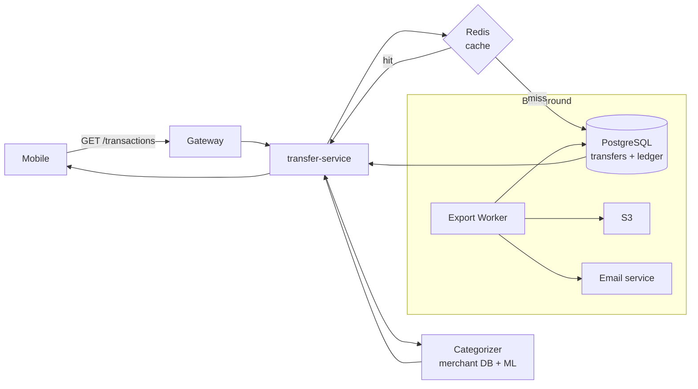

# Phase 06 — Transaction History

**Duration:** Week 10 (2026-07-08 → 2026-07-14) · **Priority:** P0 · **Status:** Not started
**Owner:** Backend Lead · **Team:** 3 backend devs + 3 mobile devs + 1 designer + 1 QA

---

## Context Links

- [Master Plan](plan.md) · [SRS FR-009](../../docs/srs.md)

## Overview

List + filter + search transaction history. Auto-categorize transactions theo merchant + ML cho spending insights. Export CSV cho 90 ngày gần nhất.

## Key Insights

- Cursor pagination, **không OFFSET** (slow trên large dataset)
- Auto-categorize qua merchant database lookup + fallback rule-based ML
- 6 categories: Ăn uống / Di chuyển / Mua sắm / Hóa đơn / Chuyển tiền / Khác
- Export CSV qua background job (không block API), email link to user
- Eager-load related entities (sender / recipient profile) — tránh N+1

## Requirements

### Functional
- FR-009: list transactions latest first, filter date / type / category, search phone / amount / note, detail view
- Export CSV (max 90 days)
- Auto-categorize ≥ 80% accuracy

### Non-functional
- Initial list load < 500ms
- Paginated load < 200ms
- Search < 800ms
- Export job < 60s cho 90 days data

## Architecture

## Related Code Files

### Create — Backend
- `services/transfer-service/src/modules/history/history.service.ts`
- `services/transfer-service/src/modules/history/history.controller.ts`
- `services/transfer-service/src/modules/categorizer/categorizer.service.ts`
- `services/transfer-service/src/modules/categorizer/merchant-database.ts`
- `services/transfer-service/src/modules/export/export-worker.ts` (BullMQ job)
- `migrations/20260708_001_add_category_to_transfers.sql`
- `migrations/20260708_002_create_merchant_categories_table.sql`
- `migrations/20260709_001_create_export_jobs_table.sql`

### Create — Mobile
- `mobile/screens/history/HistoryListScreen.tsx`
- `mobile/screens/history/TransactionDetailScreen.tsx`
- `mobile/screens/history/FilterScreen.tsx`
- `mobile/screens/history/InsightsScreen.tsx` (spending pie chart)
- `mobile/services/history.api.ts`
- `mobile/components/TransactionRow.tsx`
- `mobile/components/CategoryIcon.tsx`

## Implementation Steps

### Step 1 — DB + indexes (1 day)
1. Add `category` column to transfers
2. Composite index `(user_id, created_at DESC)` for cursor pagination
3. Merchant categories table seed với top 500 merchant VN
4. Full-text search index trên `note` column (Postgres GIN)

### Step 2 — History API (2 days)
1. List endpoint với cursor pagination
2. Filter (date range, type, category)
3. Search (phone / amount / note với fuzzy)
4. Detail endpoint với related entities (eager-load)
5. Redis cache 30s cho list (invalidate on new tx)

### Step 3 — Auto-categorize (1.5 days)
1. Merchant database lookup (exact match)
2. Fuzzy match keywords (e.g., "Highlands Coffee" → "Ăn uống")
3. Rule-based fallback: amount range + counterparty type
4. Manual override (user can re-categorize, save preference)

### Step 4 — Export CSV (1 day)
1. BullMQ job worker
2. Stream CSV to S3 (memory-efficient)
3. Pre-signed URL valid 24h
4. Email link to user qua SES

### Step 5 — Mobile UI (2 days, parallel)
- History list infinite scroll
- Filter bottom sheet
- Search bar với debounce
- Transaction detail screen
- Spending insights pie chart
- Export trigger + status notification

## Todo List

### Backend
- [ ] DB migration: add `category` column
- [ ] DB migration: composite index `(user_id, created_at DESC)`
- [ ] DB migration: merchant_categories table + seed
- [ ] DB migration: full-text search GIN index
- [ ] DB migration: export_jobs table
- [ ] List endpoint với cursor pagination
- [ ] Filter (date range, type, category)
- [ ] Search endpoint (fuzzy)
- [ ] Detail endpoint với eager-load
- [ ] Redis cache layer + invalidation
- [ ] Categorizer service (merchant DB + fuzzy + rules)
- [ ] Manual re-categorize endpoint
- [ ] Insights endpoint (spending by category aggregation)
- [ ] Export CSV worker (BullMQ)
- [ ] Email notification cho export complete
- [ ] Pre-signed S3 URL endpoint

### Mobile
- [ ] History list screen với infinite scroll
- [ ] Pull to refresh
- [ ] Filter bottom sheet
- [ ] Search bar + debounce
- [ ] Transaction row component
- [ ] Category icons (6 categories)
- [ ] Transaction detail screen
- [ ] Receipt PDF view + share
- [ ] Insights screen với pie chart (victory-native)
- [ ] Export trigger + progress UI
- [ ] Export complete notification handling

### Test
- [ ] Unit tests cursor pagination
- [ ] Unit tests categorizer (90 cases — top merchants)
- [ ] Integration test list + filter + search
- [ ] Performance test: history với 10k transactions/user, p95 < 500ms
- [ ] Export CSV correctness test
- [ ] Cache invalidation tests

## Success Criteria

- ✅ Initial list load < 500ms cho user với 1000 transactions
- ✅ Paginated load < 200ms
- ✅ Auto-categorize accuracy ≥ 80%
- ✅ Export 90-day CSV completes < 60s
- ✅ Search returns results < 800ms

## Risk Assessment

| Risk | Probability | Impact | Mitigation |
|------|:-----------:|:------:|------------|
| N+1 query trên history | High | High | Eager-load (JOIN) + lint rule against ORM lazy |
| Categorizer false positive | Medium | Low | Manual override + learn from corrections |
| Export job memory blow-up | Low | Medium | Stream-based CSV, không load all rows |
| Search slow trên large note text | Medium | Medium | GIN index + result limit + debounce client |

## Security Considerations

- Authorization check: user chỉ xem được transactions của mình
- Export rate limit: 1 export / hour / user
- Pre-signed URL expire 24h, cannot list bucket
- PII trong CSV — encrypt at rest, audit log download
- Search input sanitize against SQL injection (parameterized)

## Next Steps

- Doc impact: update [code-standards.md](../../docs/code-standards.md) với cursor pagination pattern + N+1 lint rule
