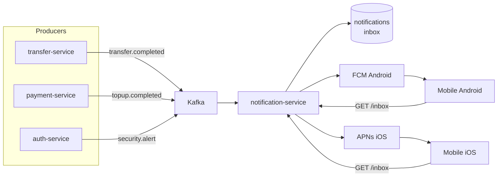

# Phase 07 — Notifications

**Duration:** Week 11 (2026-07-15 → 2026-07-21) · **Priority:** P0 · **Status:** Not started
**Owner:** Backend Lead · **Team:** 3 backend devs + 2 mobile devs + 1 designer + 1 QA

---

## Context Links

- [Master Plan](plan.md) · [SRS FR-010](../../docs/srs.md)

## Overview

Push notifications (FCM Android + APNs iOS) cho transaction events + security alerts. In-app inbox lưu 90 ngày. User-controlled granular preferences. Critical UX touch — ảnh hưởng retention.

## Key Insights

- Consume Kafka events từ transfer-service / payment-service / auth-service → don't poll
- Multi-device: 1 user có thể có 2-3 devices, send to all enrolled
- Localization VN + EN, default VN
- Deep link tới relevant screen (transaction detail, security alert page)
- Notification preferences granular: per type (transfer in / out / security / promotional)

## Requirements

### Functional
- FR-010: push notification cho receive money, send success, top-up complete, security alert
- In-app inbox 90-day retention
- Granular preferences toggle
- Deep link to relevant screen
- Localization VN + EN

### Non-functional
- Delivery rate ≥ 95% trong 30s
- p95 latency emit-to-device < 5s
- In-app inbox load < 300ms

## Architecture

## Related Code Files

### Create — Backend
- `services/notification-service/`
  - `src/modules/notifications/notification.service.ts`
  - `src/modules/notifications/notification.controller.ts`
  - `src/modules/preferences/preferences.service.ts`
  - `src/adapters/fcm.adapter.ts`
  - `src/adapters/apns.adapter.ts`
  - `src/templates/transfer-completed.template.ts`
  - `src/templates/topup-completed.template.ts`
  - `src/templates/security-alert.template.ts`
  - `src/consumers/kafka-consumer.ts`
- `services/notification-service/src/i18n/{vi,en}.json`
- `migrations/20260715_001_create_notifications_table.sql`
- `migrations/20260715_002_create_notification_preferences_table.sql`
- `migrations/20260715_003_create_device_tokens_table.sql`

### Create — Mobile
- `mobile/screens/inbox/InboxScreen.tsx`
- `mobile/screens/inbox/NotificationDetailScreen.tsx`
- `mobile/screens/settings/NotificationPreferencesScreen.tsx`
- `mobile/services/notifications.api.ts`
- `mobile/services/push-token.service.ts` (expo-notifications)
- `mobile/services/deep-link.service.ts`

## Implementation Steps

### Step 1 — Infrastructure (1 day)
1. FCM Firebase project setup, server key in Secrets Manager
2. APNs key + cert (P8 token-based auth)
3. DB migrations (notifications, preferences, device_tokens)

### Step 2 — Notification service core (2 days)
1. Kafka consumer cho 3 topics (transfer.completed, topup.completed, security.alert)
2. Template engine với i18n (VN + EN)
3. Multi-device dispatcher (parallel send all enrolled devices)
4. Retry logic exponential backoff cho FCM/APNs failure

### Step 3 — Preferences + inbox (1 day)
1. Preferences CRUD endpoint
2. Inbox list endpoint với pagination
3. Mark read endpoint
4. 90-day retention cleanup job (daily cron)

### Step 4 — Mobile (2 days, parallel)
1. expo-notifications setup + permission flow
2. Device token registration on login
3. Inbox screen
4. Notification detail + deep link handler
5. Preferences screen với granular toggles

### Step 5 — Test + polish (1 day)
- Send + receive E2E (real device)
- Permission denied flow
- Multi-device sync test
- Localization test

## Todo List

### Backend
- [ ] FCM Firebase project + server key
- [ ] APNs P8 token setup
- [ ] DB migration: notifications table
- [ ] DB migration: notification_preferences (default all on)
- [ ] DB migration: device_tokens (user × device)
- [ ] Kafka consumer: transfer.completed
- [ ] Kafka consumer: topup.completed
- [ ] Kafka consumer: security.alert
- [ ] Template engine + i18n loader
- [ ] FCM adapter
- [ ] APNs adapter
- [ ] Multi-device parallel dispatch
- [ ] Retry với exponential backoff
- [ ] Preferences endpoint (GET / PATCH)
- [ ] Inbox list endpoint với pagination
- [ ] Mark read / mark all read endpoint
- [ ] Device token register / deregister endpoint
- [ ] 90-day cleanup cron job

### Mobile
- [ ] expo-notifications setup
- [ ] Permission request flow (with rationale screen)
- [ ] Device token register on login
- [ ] Device token deregister on logout
- [ ] Inbox screen + infinite scroll
- [ ] Notification detail
- [ ] Deep link router (transfer detail, security page)
- [ ] Preferences screen
- [ ] Badge counter on app icon
- [ ] In-app banner cho foreground notification

### Test
- [ ] Unit tests templates + i18n
- [ ] Unit tests Kafka consumers
- [ ] Integration test E2E send → receive
- [ ] Multi-device dispatch test
- [ ] Permission denied UX test
- [ ] Deep link routing tests

## Success Criteria

- ✅ Delivery rate ≥ 95% trong 30s (DataDog metric)
- ✅ Push received trên 2 enrolled devices simultaneously
- ✅ Deep link open correct screen
- ✅ Preferences honored — disabled type không gửi push
- ✅ Localization correct VN / EN dựa trên device language
- ✅ Coverage ≥ 80%

## Risk Assessment

| Risk | Probability | Impact | Mitigation |
|------|:-----------:|:------:|------------|
| FCM token rotation cause delivery fail | Medium | Medium | Auto-refresh on app start, deregister stale tokens |
| APNs cert expire (1-year) | Low | High | Calendar reminder + token-based P8 (no expire) |
| User permission denied → can't notify | Medium | Medium | Rationale screen + in-app inbox fallback |
| Notification spam → opt-out | Medium | Medium | Granular preferences + smart defaults |
| Kafka consumer lag → delayed notification | Low | Medium | Consumer scaling + lag alert |

## Security Considerations

- Notification payload không chứa sensitive data (chỉ mention amount + masked counterparty)
- Deep link URL signed với HMAC, expire 5 phút (chống replay)
- Device token rotation on suspicious activity
- Audit log security alert delivery

## Next Steps

- Unblocks Phase 08 (Hardening + Launch) — last feature phase
- Doc impact: update [system-architecture.md](../../docs/system-architecture.md) với notification flow
