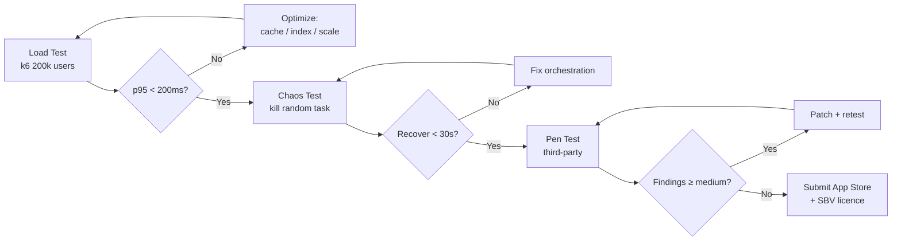

# Phase 08 — Hardening + Launch

**Duration:** Week 12 (2026-07-22 → 2026-07-28) · **Priority:** P0 ⚡ Critical · **Status:** Not started
**Owner:** Eng Lead + PM · **Team:** All 8 backend + 4 mobile + 2 designers + 1 PM + 1 QA

---

## Context Links

- [Master Plan](plan.md) · All previous phase docs · [SRS NFRs](../../docs/srs.md)

## Overview

Pre-launch hardening: comprehensive testing, security audit, compliance review, performance tuning, app store submission, monitoring polish. Tuần này KHÔNG add feature — chỉ harden + ship.

Beta test 500 users tuần kế tiếp (Week 13), public launch Week 16 sau khi SBV licence in hand.

## Key Insights

- Apple App Review thường take 2-7 ngày — submit Day 1 của tuần này
- Penetration test phải xong trước SBV submission
- Load test target: **2x peak forecast** (200k concurrent thay vì 100k) để có buffer
- Chaos engineering: kill random ECS task, validate auto-recover < 30s
- Final security audit external (third-party) — không nên self-audit

## Requirements

### Functional (no new features)
- All P0 FRs from previous phases verified
- Bug fixes only (P0/P1)
- Documentation polished
- Runbooks ready

### Non-functional (validate all)
- NFR-001 Performance: p95 < 200ms validated qua load test
- NFR-002 Availability: chaos test → auto-recover < 30s
- NFR-003 Scalability: load test 200k concurrent
- NFR-004 Security: penetration test pass, OWASP Top 10 clean
- NFR-005 Compliance: SBV submission complete, PCI-DSS audit pass
- NFR-006 Usability: beta test prep complete
- NFR-007 Reliability: zero data loss in chaos test

## Architecture Validation

## Related Files

### Modify
- All previously created services (bug fixes)
- `infra/terraform/envs/prod/main.tf` (final scaling params)
- `mobile/app.json` (production config)
- `docs/deployment-guide.md` (full runbook)
- `docs/system-architecture.md` (final version after tuning)

### Create
- `docs/security-audit-260605.md` (external audit report)
- `docs/penetration-test-260605.md`
- `docs/load-test-results-260605.md`
- `docs/chaos-test-results-260605.md`
- `docs/compliance-checklist-sbv.md`
- `docs/runbook-on-call.md`
- `docs/incident-response-playbook.md`
- `plans/reports/code-review-final-260605.md`

## Implementation Steps

### Day 1 (Mon) — Submit + audit kickoff
- Submit iOS build to App Review (TestFlight + production review)
- Submit Android build to Play Store internal track + production
- Engage external pen test firm (start scan)
- Final compliance review checklist với legal team
- Submit SBV licence application với supporting docs

### Day 2 (Tue) — Load test
- k6 test: 200k concurrent users (2x peak forecast)
- Validate p95 < 200ms across all endpoints
- Identify + fix bottlenecks (likely DB query optimization)
- DataDog dashboard final tuning
- Alert thresholds calibration

### Day 3 (Wed) — Chaos test
- Kill random ECS task → validate auto-recover < 30s
- DB failover test (RDS Multi-AZ) → validate RTO < 5 min
- Redis primary failure → cluster failover < 10s
- Kafka broker kill → in-flight events not lost
- Sepay outage simulation → graceful degradation

### Day 4 (Thu) — Penetration test review + fixes
- Receive pen test findings
- Triage by severity (Critical / High / Medium / Low)
- Patch all Critical + High same day
- Re-test patched endpoints

### Day 5 (Fri) — Final QA + documentation
- Full regression test (manual + automated)
- Bug bash with internal team (50 testers)
- Documentation review (all docs final pass)
- Runbooks final
- Beta test preparation (user list, communication template)

### Weekend buffer (Sat-Sun)
- Buffer cho App Review feedback / fixes
- On-call rotation set up
- Final smoke test production

## Todo List

### Testing & Validation
- [ ] Load test: 200k concurrent users
- [ ] Load test: validate p95 < 200ms all endpoints
- [ ] Chaos test: kill random ECS task → auto-recover
- [ ] Chaos test: RDS failover → RTO < 5 min
- [ ] Chaos test: Redis primary failure
- [ ] Chaos test: Kafka broker kill
- [ ] Chaos test: Sepay outage simulation
- [ ] External pen test (third-party)
- [ ] Pen test findings triage + patch Critical/High
- [ ] Re-test patched endpoints
- [ ] Full regression test (manual)
- [ ] Bug bash (50 internal testers)
- [ ] Mobile crash test (low-end Android, iOS 14)

### Compliance & Legal
- [ ] SBV licence application submitted
- [ ] PCI-DSS Level 1 audit certification
- [ ] Personal Data Protection compliance review
- [ ] AML reporting workflow tested
- [ ] Privacy policy + ToS final
- [ ] Cookie policy (web landing page)

### App Stores
- [ ] iOS app submitted to App Review
- [ ] iOS production build + TestFlight beta
- [ ] Android Play Store internal track
- [ ] Android production track submission
- [ ] App Store screenshots (5 sizes)
- [ ] Play Store screenshots
- [ ] App descriptions VN + EN
- [ ] Privacy nutrition labels (iOS)

### Operations
- [ ] On-call rotation set up (PagerDuty)
- [ ] Runbook: incident response
- [ ] Runbook: deployment + rollback
- [ ] Runbook: database recovery
- [ ] Runbook: Sepay outage
- [ ] DataDog alert thresholds final
- [ ] Sentry alert routing
- [ ] Status page setup (statuspage.io)

### Documentation
- [ ] All docs in `docs/` final pass
- [ ] API documentation (OpenAPI 3 + Postman collection)
- [ ] System architecture final
- [ ] Deployment guide
- [ ] Security audit report
- [ ] Pen test report (sanitized version for compliance)
- [ ] Load test results
- [ ] Chaos test results

### Beta Test Prep
- [ ] Beta tester list (500 users)
- [ ] Beta invitation email template
- [ ] Beta feedback form
- [ ] In-app feedback widget
- [ ] Beta test analytics dashboard

## Success Criteria

- ✅ All P0 + P1 bugs zero
- ✅ Load test: p95 < 200ms ở 200k concurrent
- ✅ Chaos test: auto-recover < 30s mọi failure mode
- ✅ Pen test: zero Critical, zero High open
- ✅ App Store + Play Store internal tracks live
- ✅ SBV licence submitted (in pipeline)
- ✅ PCI-DSS Level 1 cert
- ✅ All docs reviewed + signed off
- ✅ On-call rotation active
- ✅ Beta tester list confirmed

## Risk Assessment

| Risk | Probability | Impact | Mitigation |
|------|:-----------:|:------:|------------|
| App Store rejection | Medium | High | Early submission Mon, fix loop ready, accept 1-2 iterations |
| Pen test critical finding | Medium | High | Day 4 dedicated to fix loop, buffer day 5 |
| SBV licence delay > 4 weeks | Medium | Critical | Application Day 1 + parallel work với regulatory consultant |
| Load test reveals fundamental issue | Low | Critical | Phase 04 chaos test should catch most; if critical, delay launch 2 weeks |
| Beta user negative feedback | Medium | Medium | Iterate Week 13-14 before public launch Week 16 |

## Security Considerations

- Final security audit by external firm (CrowdStrike or local equivalent)
- Penetration test reproduce reports archived 5 years
- Bug bounty program kickoff (low-tier reward, scaling up post-launch)
- Incident response team identified + tested (tabletop exercise)
- Compromise scenarios documented (key rotation procedure, customer communication template)

## Launch Checklist (Week 16 — Public)

- [ ] SBV licence approved
- [ ] App Store + Play Store production approved
- [ ] Marketing campaign launch
- [ ] Customer support team trained
- [ ] Status page live
- [ ] Press release + social media
- [ ] First-day hyper-care: all eng on standby

## Next Steps (post-launch)

- Phase 2 planning: Bill payment, top-up, savings goals (Q4 2026)
- Customer feedback loop (NPS survey, in-app rating)
- Incident retrospectives quarterly
- Doc impact: massive update [docs/](../../docs/) — system-architecture, deployment-guide, code-standards, project-changelog

---

**MVP done.** From here, the team transitions từ "build" mode → "operate + improve" mode.
