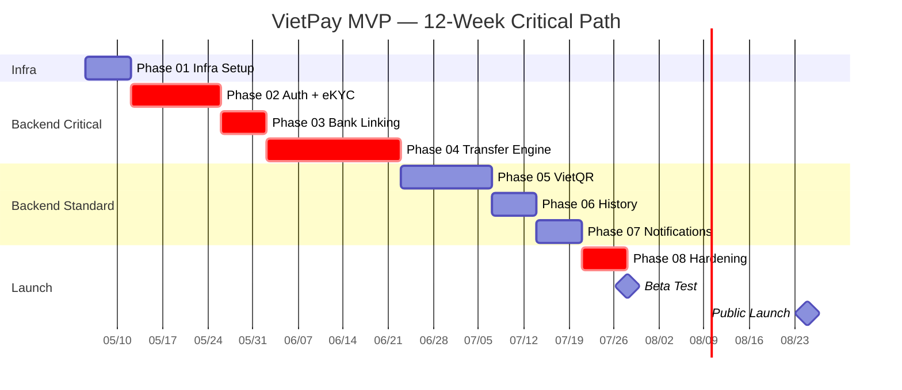
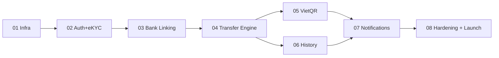

# VietPay MVP — Master Plan

**Project:** VietPay — Digital Wallet & P2P Transfer App
**Plan ID:** 260505-1100-vietpay-mvp
**Duration:** 12 tuần (2026-05-05 → 2026-07-28)
**Team:** 8 backend devs, 4 mobile devs, 2 designers, 1 PM, 1 QA
**Owner:** Planner Agent · **Approved by:** Eng Lead, Product Owner

---

## Context Links

- [SRS](../../docs/srs.md)
- [System Architecture](../../docs/system-architecture.md)
- [Idea Brainstorm](../../docs/idea-brainstorm.md)
- [Competitive Analysis](../../docs/competitive-analysis.md)
- [Onboarding Wireframe](../../docs/wireframes/onboarding-flow.md)
- [P2P Transfer Wireframe](../../docs/wireframes/p2p-transfer-flow.md)
- [VietQR Scan Wireframe](../../docs/wireframes/vietqr-scan-flow.md)

---

## Overview

MVP launch ví điện tử VietPay với 3 core capabilities:
1. **P2P money transfer** (phone / bank account / QR)
2. **VietQR payment** (generate + scan)
3. **Transaction history** với auto-categorization

Build từ scratch trên AWS, microservices NestJS + React Native + Expo. Pass SBV compliance + PCI-DSS Level 1.

---

## Phases Overview

| # | Phase | Duration | Owner | Status | Critical |
|---|-------|----------|-------|--------|----------|
| [01](phase-01-infrastructure-setup.md) | Infrastructure Setup | Week 1 | DevOps | Not started | |
| [02](phase-02-auth-ekyc.md) | Auth + eKYC | Week 2-3 | Backend + Mobile | Not started | ⚡ |
| [03](phase-03-bank-account-linking.md) | Bank Account Linking | Week 4 | Backend | Not started | ⚡ |
| [04](phase-04-p2p-transfer-engine.md) | P2P Transfer Engine | Week 5-7 | Backend | Not started | ⚡ |
| [05](phase-05-vietqr-payment.md) | VietQR Payment | Week 8-9 | Backend + Mobile | Not started | |
| [06](phase-06-transaction-history.md) | Transaction History | Week 10 | Backend + Mobile | Not started | |
| [07](phase-07-notifications.md) | Notifications | Week 11 | Backend + Mobile | Not started | |
| [08](phase-08-hardening-launch.md) | Hardening + Launch | Week 12 | All | Not started | ⚡ |

⚡ = Critical path

---

## Critical Path

---

## Dependencies

---

## Resource Allocation

| Role | Count | Phase 01 | 02 | 03 | 04 | 05 | 06 | 07 | 08 |
|------|------:|:---:|:---:|:---:|:---:|:---:|:---:|:---:|:---:|
| Backend dev | 8 | 2 | 4 | 3 | 6 | 4 | 3 | 3 | 8 |
| Mobile dev | 4 | 1 | 3 | 2 | 4 | 4 | 3 | 2 | 4 |
| Designer | 2 | 0 | 2 | 1 | 1 | 2 | 1 | 1 | 1 |
| PM | 1 | 1 | 1 | 1 | 1 | 1 | 1 | 1 | 1 |
| QA | 1 | 0 | 1 | 1 | 1 | 1 | 1 | 1 | 1 |

---

## Milestones

| Date | Milestone | Definition of Done |
|------|-----------|---------------------|
| 2026-05-12 | Infra ready | All services deployable, CI/CD green, observability live |
| 2026-05-26 | Auth + eKYC complete | User register + KYC approval flow E2E working |
| 2026-06-02 | Bank linking complete | User link 1 bank successfully, micro-deposit verified |
| 2026-06-23 | Transfer engine MVP | P2P transfer (phone) + bank transfer working in staging |
| 2026-07-07 | VietQR done | Generate + scan + pay E2E working |
| 2026-07-14 | History done | Transaction list + filter + export working |
| 2026-07-21 | All features feature-complete | Notification + integration test pass |
| 2026-07-28 | MVP code-complete | All P0 done, code review pass, security audit pass |
| 2026-08-04 | Internal beta | 500 internal users testing |
| 2026-08-25 | **Public Launch** | App Store + Play Store live, SBV licence in hand |

---

## Risk Register

| Risk | Probability | Impact | Mitigation | Owner |
|------|:-----------:|:------:|------------|-------|
| SBV licence delay | Medium | Critical | Apply Week 1, parallel with dev | PM |
| Sepay API instability | Medium | High | Sandbox early, fallback bank direct integration | Backend Lead |
| eKYC accuracy < 92% | Medium | High | Manual review queue, fall back FPT | Backend Lead |
| Race condition in transfer | Medium | Critical | SELECT FOR UPDATE + chaos testing | Backend Lead |
| Mobile app rejection (Apple) | Low | High | Submit early to App Store review (Week 11) | Mobile Lead |
| Team velocity < estimate | Medium | Medium | Buffer 1 week ở Phase 08, descope P0 nice-to-haves | PM |
| Security audit findings critical | Low | Critical | Security review at Phase 04 (mid-build), not end | Security Lead |

---

## Success Criteria (MVP Release)

- ✅ All 12 P0 functional requirements implemented
- ✅ All 8 NFRs validated (load test, security audit, compliance review)
- ✅ Code coverage ≥ 80% line, ≥ 70% branch
- ✅ Zero P0/P1 bugs open
- ✅ App Store + Play Store internal track approved
- ✅ SBV licence in hand
- ✅ Beta test 500 users, NPS ≥ 40
- ✅ Load test 1000 concurrent users, p95 < 200ms, error rate < 0.5%

---

## Communication Plan

- **Daily standup:** 9:00 AM, 15 min, all engineers
- **Phase review:** end of each phase, demo + retro, 1 hour
- **Sprint planning:** Monday Week N+1, 2 hours
- **Stakeholder update:** weekly Friday, 30 min, async via Slack + summary

---

## Out of Scope (Phase 2+)

- Bill payment / mobile top-up (Phase 2)
- Goal-based savings (Phase 2)
- Recurring payments (Phase 2)
- Investment products (Phase 3)
- Web app (Phase 3)
- Multi-language (Phase 3)
- Multi-currency (Phase 3)

---

## Open Questions

- Có nên build feature flag system ở Phase 01 hay đợi sau MVP? (Currently leaning yes)
- A/B testing infra: tự build hay dùng GrowthBook self-hosted? (Decision Phase 02)
- Loyalty / referral program — design ở MVP hay Phase 2? (Marketing input needed)
