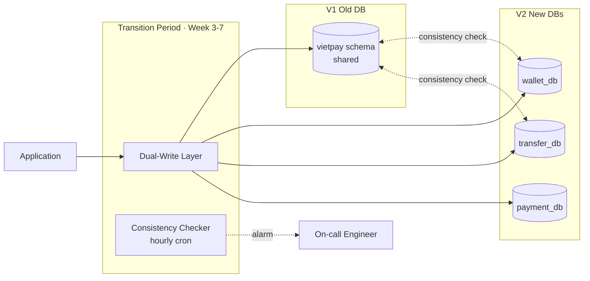
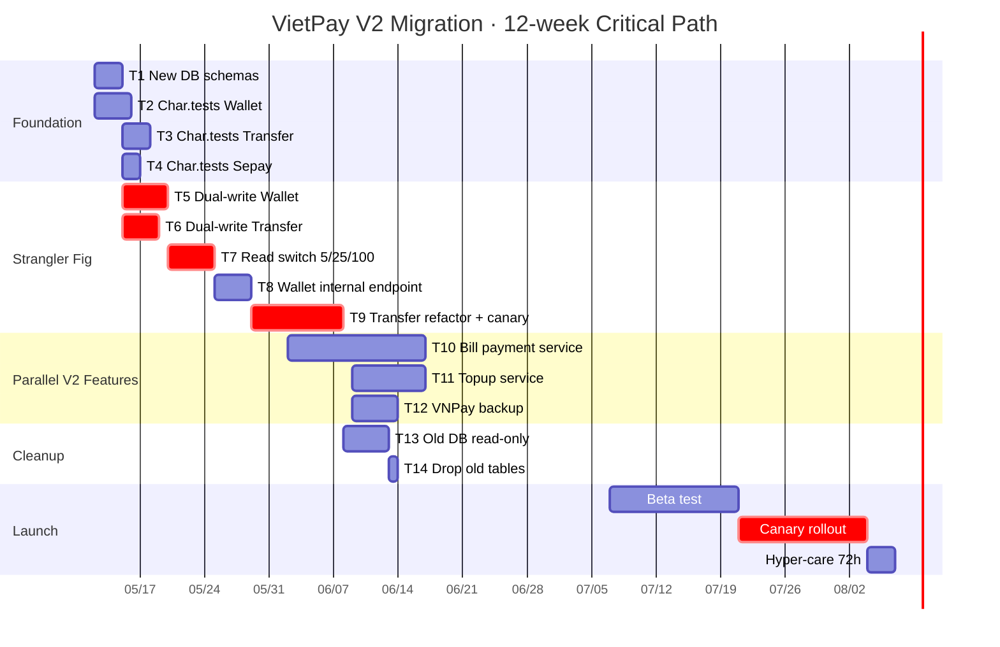

# VietPay V1 → V2 Migration Plan

**Plan ID:** 260505-1100-vietpay-v2
**Type:** BROWNFIELD migration (V1 in production with 312k MAU)
**Strategy:** Strangler Fig + Dual Write
**Duration:** 8 tuần dev + 2 tuần beta + 2 tuần canary rollout = 12 tuần total
**Owner:** Migration Strategist Agent · Tech Lead (Long N.)
**Status:** APPROVED by 👤 Human Gate (Tech Lead + PM + Customer SME) — 2026-05-06

---

## Context Links

- [Codebase Summary V1](../../docs/codebase-summary.md)
- [Architecture As-Is](../../docs/architecture-as-is.md)
- [Gap Analysis](../../docs/gap-analysis.md)
- [Characterization Tests Spec](../../docs/characterization-tests-spec.md)
- Customer brief: `customer-input/v2-requirements-brief.docx`

---

## 1. Migration Strategy — Why Strangler Fig

### Options considered

| Strategy | Pros | Cons | Verdict |
|----------|------|------|---------|
| **Big Bang** (V1 down → V2 up) | Simple, fast | High risk, downtime, no rollback granularity | ❌ Rejected — 312k MAU không thể downtime |
| **Strangler Fig** (gradual replace) | Zero downtime, granular rollback, low blast radius | Longer timeline, dual-write complexity | ✅ **CHOSEN** |
| **Incremental** (feature-by-feature) | Low risk per change | Doesn't address shared-DB anti-pattern | ❌ Doesn't solve core problem |

### Strangler Fig flow

---

## 2. Phased Tasks (14 tasks across 12 weeks)

### Week 1-2 · Foundation + Characterization Tests

#### Task 1 · Setup new DB schemas (mirror)
- **Owner**: DevOps + Backend Lead
- **Output**: `wallet_db`, `transfer_db`, `payment_db` instances created (dev/staging/prod)
- **Files**: `infra-cdk/lib/v2-databases-stack.ts` (new)
- **Acceptance**: 3 RDS instances running, Multi-AZ, encryption at rest
- **Estimate**: 3 days

#### Task 2 · Characterization Tests · Wallet ledger (47 tests)
- **Owner**: Char. Test Writer Agent + 1 backend dev
- **Output**: `tests/characterization/wallet-ledger.spec.ts` — pin all V1 wallet behavior including 3 undocumented gotchas
- **Files**: `tests/characterization/wallet-ledger.spec.ts` (new)
- **Acceptance**: 47/47 pass against V1 production replica
- **Estimate**: 4 days

#### Task 3 · Characterization Tests · Transfer engine (23 tests)
- **Owner**: Char. Test Writer Agent + 1 backend dev
- **Output**: `tests/characterization/transfer-engine.spec.ts` — including HTTP 200 quirk on rollback (V1 gotcha)
- **Files**: `tests/characterization/transfer-engine.spec.ts` (new)
- **Acceptance**: 23/23 pass
- **Estimate**: 3 days

#### Task 4 · Characterization Tests · Payment Sepay integration (18 tests)
- **Owner**: 1 backend dev
- **Output**: `tests/characterization/sepay-integration.spec.ts`
- **Acceptance**: 18/18 pass với Sepay sandbox
- **Estimate**: 2 days

---

### Week 3 · Dual-Write Implementation

#### Task 5 · Build dual-write layer in wallet-service
- **Owner**: Backend Lead + 2 backend devs
- **Output**: `wallet-service/src/dual-write/` adapter — write to BOTH old shared DB và new `wallet_db`
- **Files**: `wallet-service/src/dual-write/dual-write.service.ts`, `wallet-service/src/dual-write/consistency-checker.ts`
- **Acceptance**:
  - All wallet writes go to both DBs
  - Hourly cron compares row counts + sample row hash
  - Alarm if mismatch > 0.01%
- **Estimate**: 5 days

#### Task 6 · Build dual-write layer in transfer-service
- **Owner**: 2 backend devs
- **Output**: Mirror dual-write for `transfers`, `idempotency_keys`, `ledger_entries` tables
- **Estimate**: 4 days

---

### Week 4 · Read Switch (gradual)

#### Task 7 · Wallet read traffic switch · 5% → 25% → 100%
- **Owner**: Backend Lead + DevOps
- **Output**: Feature flag `v2.wallet.read-from-new-db` controlled via LaunchDarkly
- **Acceptance**:
  - 5% (24h): error rate <0.1%, latency baseline
  - 25% (48h): same SLO check
  - 100%: cutover complete, monitor 1 week
- **Estimate**: 1 week

#### Task 8 · Wallet internal debit/credit endpoint (GAP-05)
- **Owner**: Backend Lead
- **Output**: `POST /wallets/internal/debit-credit` atomic, idempotent, mTLS-only
- **Files**: `wallet-service/src/internal/debit-credit.controller.ts` (new)
- **Acceptance**: 100% concurrent transfer load test passes, no race conditions
- **Estimate**: 4 days

---

### Week 5-6 · Refactor Transfer Bypass + New Features Parallel

#### Task 9 · Refactor transfer-service · stop bypassing wallet (GAP-09)
- **Owner**: 2 backend devs
- **Output**: Replace direct `UPDATE wallets` with `walletService.internalDebitCredit()` call
- **Files**: `transfer-service/src/modules/transfers/transfer.service.ts` (modify)
- **Acceptance**:
  - All 23 char. tests still green
  - Canary deploy 1% → 5% → 25% → 100% with SLO check each stage
- **Estimate**: 1 week + 1 week canary
- **Risk**: 🔴 critical — hot path

#### Task 10 · Build bill-payment-service (GAP-01) · parallel
- **Owner**: 2 backend devs + 1 mobile
- **Output**: New service `services/bill-payment-service/` handling EVN, Internet, Mobile, Water
- **Files**: `services/bill-payment-service/` (new module ~3.2k LOC)
- **Acceptance**: 4 providers integrated, 24 unit tests, 8 integration tests
- **Estimate**: 3 weeks (start Week 4)

#### Task 11 · Build topup-service (GAP-02) · parallel
- **Owner**: 1 backend dev + 1 mobile
- **Output**: Topup service for 3 carriers
- **Files**: `services/topup-service/` (new ~1.8k LOC)
- **Acceptance**: 3 carriers integrated, 18 unit tests
- **Estimate**: 1.5 weeks (start Week 5)

#### Task 12 · VNPay backup adapter (GAP-03) · parallel
- **Owner**: 1 backend dev
- **Output**: `payment-service/src/adapters/vnpay-direct.adapter.ts` for top 5 banks
- **Acceptance**: Contract test passes, fallback logic kicks in if Sepay returns 5xx
- **Estimate**: 1 week (start Week 5)

---

### Week 7 · Old DB Cleanup

#### Task 13 · Mark old wallet/transfer tables read-only
- **Owner**: DevOps + Backend Lead
- **Output**: Postgres role removes WRITE on old `vietpay.wallets` and related
- **Acceptance**:
  - All writes go to new DBs only
  - Monitor 5 days · zero application errors
  - Consistency checker stays green
- **Estimate**: 5 days monitoring

---

### Week 8 · Polish + Pre-launch

#### Task 14 · Drop old tables · final cutover
- **Owner**: DevOps
- **Acceptance**: Old `vietpay.wallets`, `vietpay.transfers` etc. dropped (after 1 week monitoring)
- **Estimate**: 1 day execution + ongoing monitoring

#### Task 15 · Notification templates + audit extension (GAP-06, GAP-07)
- **Owner**: 1 backend dev
- **Estimate**: 3 days

#### Task 16 · Mobile UX polish + dependency upgrades (GAP-10, GAP-11, GAP-12)
- **Owner**: Mobile + Backend
- **Estimate**: 1 week (parallel)

---

### Week 9-10 · Beta Test
- 1000 internal users + 500 selected V1 users
- Feedback survey + in-app rating
- Bug bash mid-beta · iterate

### Week 11-12 · Canary Rollout to Production
- Stage 1 (5%, 4h) → Stage 2 (25%, 8h) → Stage 3 (50%, 24h) → Stage 4 (100%)
- Each stage: SLO gate (error rate, p95, business metrics)
- 72h hyper-care after 100%

---

## 3. Critical Path

**Critical path**: T1 → T5/T6 → T7 → T8 → T9 → T13 → T14 → Canary = ~10 weeks. Buffer 2 weeks for issues.

---

## 4. Risk Register

| ID | Risk | Severity | Probability | Mitigation | Owner |
|----|------|:--------:|:-----------:|------------|-------|
| R1 | Dual-write inconsistency | 🔴 CRIT | Medium | Hourly checker + alarm + manual reconcile script | Tech Lead |
| R2 | Transfer refactor breaks hot path | 🔴 CRIT | Medium | Char. tests + canary 1% → 100% with SLO gate | Backend Lead |
| R3 | Performance regression wallet read | 🟡 HIGH | High (extra hop) | Redis cache 30s TTL + invalidate on tx + monitor | Backend Lead |
| R4 | Sepay bill API delay | 🟡 HIGH | Medium | Start onboarding Day 1 + fallback direct provider APIs | PM |
| R5 | VNPay legal delay | 🟡 HIGH | Medium | Start legal Day 1 (parallel) | Legal + PM |
| R6 | Customer SME unavailable Final Review | 🟢 MED | Low | Pre-schedule + async review fallback | PM |
| R7 | Beta negative feedback | 🟢 MED | Medium | Iterate week 10 before canary | Mobile Lead |
| R8 | Cutover during peak hours | 🔴 CRIT | Low | Schedule cutover 02:00-04:00 GMT+7 (low traffic) | DevOps |
| R9 | Old DB drop too early | 🟡 HIGH | Low | 1 week monitoring read-only before drop | Backend Lead |
| R10 | Mobile app-store rejection on V2 | 🟡 HIGH | Low | Submit early Week 9 (during beta) | Mobile Lead |
| R11 | DataDog cost spike (more services) | 🟢 MED | High | Pre-budget +25%, log sampling rules | DevOps |
| R12 | Compliance audit findings new modules | 🟡 HIGH | Medium | Compliance review at end of Week 6 (mid-build) | Compliance |
| R13 | Git/CI bottleneck (parallel workstreams) | 🟢 MED | High | Feature branches + monorepo build cache | DevOps |
| R14 | Knowledge silo (only 2 people understand wallet code) | 🟡 HIGH | High | Pair programming + live walkthroughs Week 1-2 | Tech Lead |

---

## 5. Rollback Plan (per task)

### Task-level rollback
- **T5/T6 (dual-write)**: feature flag `v2.dual-write.enabled` OFF → instant revert to write-only-old
- **T7 (read switch)**: feature flag `v2.wallet.read-from-new-db` OFF → instant revert
- **T9 (transfer refactor)**: feature flag `v2.transfer.use-wallet-internal-api` OFF → revert to bypass
- **T10/T11 (new services)**: feature flag `v2.bill-payment.enabled` / `v2.topup.enabled` OFF → hide UI, queue requests for retry

### Catastrophic rollback (full V1 restore)
- Restore wallet/transfer tables from Aurora point-in-time backup (max 5 min lag)
- Set all V2 feature flags OFF
- Revert mobile app to previous TestFlight/Play Store version (force update)
- **RTO target**: < 15 minutes

---

## 6. Success Criteria

### Technical
- ✅ Zero data loss during migration
- ✅ Zero unplanned downtime
- ✅ p95 latency increase < 10% on hot paths (transfer, wallet read)
- ✅ All char. tests stay green
- ✅ All V1 baseline tests stay green (218 + 88 char. = 306 minimum)
- ✅ Coverage ≥ 85% line on new V2 code

### Business
- ✅ Customer SME sign-off
- ✅ Beta NPS ≥ 4.0 (out of 5)
- ✅ Bill payment success rate ≥ 99.5% in beta
- ✅ Topup success rate ≥ 99.5% in beta
- ✅ Zero P0/P1 incidents in 72h hyper-care window

### Compliance
- ✅ SBV review of new modules pass
- ✅ AML reporting extended cover bill + topup
- ✅ Audit log retention 7 năm verified for new tables

---

## 7. Communication Plan

- **Daily standup**: 9:00 AM, focus on critical path tasks
- **Weekly retro**: Friday 4PM, surface blockers
- **Customer SME sync**: bi-weekly with PO Linh M.
- **Compliance check-in**: end of Week 3, 6, 8
- **Stakeholder update**: weekly Friday async via Slack `#vietpay-v2`
- **Cutover war room**: Slack `#cutover-war-room`, on-call rotation 24/7 for cutover week

---

## 8. Out of Scope

- Refund feature (V3)
- Recurring auto-pay (V3)
- Multi-currency
- Web app
- Investment products
- Multi-region active-active

---

## 9. Plan Review Sign-off (Human Gate)

| Reviewer | Role | Decision | Date |
|----------|------|:--------:|------|
| Long N. | Tech Lead | ✅ APPROVED | 2026-05-06 |
| Quân T. | PM | ✅ APPROVED | 2026-05-06 |
| Linh M. | 👤 Customer SME (PO) | ✅ APPROVED | 2026-05-06 |
| Trang H. | Compliance | ✅ APPROVED | 2026-05-06 |

**Decision**: PROCEED with migration starting Week of 2026-05-12.

---

## Open Questions

- Có cần dedicated war-room engineer trong cutover Week 7 (Task 13)? → PM confirm tuần kế tiếp
- VNPay merchant ID cấp tới khi nào? → Legal team check 2026-05-10
- Customer SME availability cho 4 review checkpoints (W3, W6, W10, W12)? → PM lock calendar
